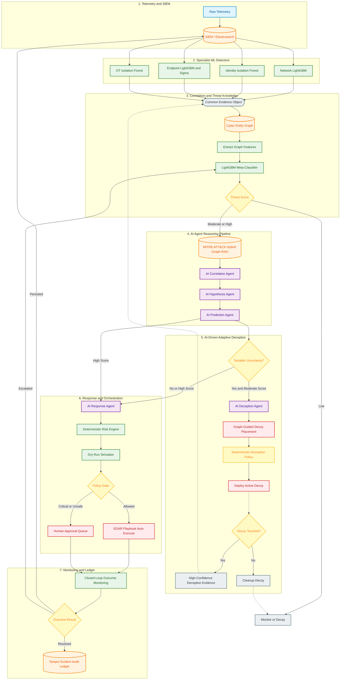

# Sentinel-Prime — Final Combined Architecture

> **Version 3 — Specialist ML detectors + LightGBM meta-correlation + constrained AI decision reasoning + adaptive deception.**
>
> **Agent Architecture: 3-stage AI pipeline (Analysis → Critique → Action).**

---

## Design Principle

```
ML detects measurable behaviour.
The graph connects entities and attack paths.
ATT&CK Graph-RAG retrieves threat knowledge before AI reasoning.
Constrained AI agents correlate, hypothesize, predict, test uncertainty, and plan responses.
Deterministic policy — not the LLM — authorizes execution.
```

---

## Why This Architecture

The previous design used Isolation Forest and XGBoost as global models after pooling all datasets. This is technically questionable because CSE-CIC-IDS2018, LANL Auth, Splunk BOTS, and HAI represent **different feature spaces** and should not be row-wise merged.

The revised design:
- Trains a **specialist detector for each behavioral layer** (network, identity, endpoint, OT)
- Each detector produces a structured **Common Evidence Object**
- A **LightGBM meta-classifier** correlates the evidence signals
- **3 constrained Gemini Flash AI agents** reason over the correlated evidence + ATT&CK knowledge in a sequential pipeline
- **Deterministic policy** controls execution

---

## Datasets

| Behaviour | Dataset | Why chosen | Limitation |
|---|---|---|---|
| **Network** | CSE-CIC-IDS2018 | Enterprise-like, labeled attacks, 80 CICFlowMeter features | Not rich in UEBA or OT data |
| **Identity / UEBA** | LANL Auth | 708M+ auth events, strong for user-host relationship learning | Auth only — no endpoint or OT |
| **Endpoint / SIEM** | Splunk BOTS v3 + OTRF Mordor | SOC investigation context + adversarial host/network telemetry | BOTS is investigation/CTF format |
| **OT / ICS** | HAI | HIL-augmented ICS testbed (steam-turbine, hydropower) — relevant to power/industrial CNI | Sector-specific, no enterprise identity |
| **Threat knowledge** | MITRE ATT&CK STIX 2.1 | Tactics, techniques, groups, software, mitigations — for RAG and graph constraints | Knowledge base, not telemetry |

### Dataset links

- [CSE-CIC-IDS2018](https://www.unb.ca/cic/datasets/ids-2018.html) | [AWS Open Data](https://registry.opendata.aws/cse-cic-ids2018/)
- [LANL Authentication](https://csr.lanl.gov/data/auth/)
- [Splunk BOTS v3](https://github.com/splunk/botsv3)
- [OTRF Security Datasets / Mordor](https://github.com/OTRF/Security-Datasets)
- [HAI ICS Dataset](https://github.com/icsdataset/hai)
- [MITRE ATT&CK STIX Data](https://github.com/mitre-attack/attack-stix-data)

### Indian CNI positioning

> Due to the sensitivity and limited public availability of Indian critical-national-infrastructure telemetry, Sentinel-Prime uses internationally recognized enterprise and ICS datasets for initial detector training and benchmarking. Deployment-specific behavioural baselines are learned from organization telemetry, while synchronized attack-correlation data is generated in an isolated cyber range for meta-correlation calibration.

---

## Model Selection

| Component | Model | Why selected |
|---|---|---|
| **Network** | LightGBM | CIC-IDS2018 is labeled tabular flow data; CPU-efficient, learns nonlinear feature interactions |
| **Identity / UEBA** | Isolation Forest | Complete labels for compromised identities unavailable; learns unusual behavioural windows unsupervised |
| **Endpoint / SIEM** | LightGBM + Sigma | LightGBM learns process/log feature interactions; Sigma adds deterministic explainable evidence |
| **OT / ICS** | Isolation Forest (+ optional TCN-AE upgrade) | Cheap normal-process baseline; TCN upgrade captures temporal dynamics if compute allows |
| **Threat correlation** | LightGBM Meta-Classifier | Combined evidence is low-dimensional tabular; a Fusion Transformer would need unavailable synchronized data |
| **ATT&CK retrieval** | FAISS + Sentence Transformer | Small pretrained encoder + efficient vector search; no embedding pretraining required |
| **ATT&CK structure** | ATT&CK Knowledge Graph (NetworkX) | Preserves tactic→technique→software→group→mitigation relationships for graph traversal |
| **AI reasoning** | Gemini Flash (3 constrained agents) | Analysis → Critique → Action pipeline; API inference avoids local LLM training |
| **Graph analytics** | NetworkX (Cyber Entity Graph) | Attack paths, reachability, centrality, community-crossing, blast-radius features |
| **Risk scoring** | Deterministic Python/NumPy | Business impact and blast radius must not depend on free-form LLM judgment |
| **Execution** | Deterministic Policy Gate + SOAR | The LLM must never directly execute CNI containment actions |
| **Deception** | AI-driven adaptive honeypots | Prediction-aligned decoys feed high-confidence evidence back into correlation |

---

## Specialist Detectors — Inputs & Outputs

### Network Detector (LightGBM)

**Dataset:** CSE-CIC-IDS2018

**Input features:** `flow_duration`, `total_fwd/bwd_packets`, `packet_length_stats`, `flow_bytes/packets_per_sec`, `flow_iat_mean/std`, `TCP_flag_counts`, `active/idle_mean`, `destination_port`, `protocol`

```json
{
  "network_score": 0.91,
  "attack_class": "infiltration",
  "attack_probabilities": {"benign": 0.03, "ddos": 0.02, "botnet": 0.08, "infiltration": 0.87},
  "confidence": 0.94
}
```

### Identity / UEBA Detector (Isolation Forest)

**Dataset:** LANL Auth

**Derived features:** `login_hour_deviation`, `auth_frequency_1h/24h`, `unique_hosts_1h/24h`, `new_host_ratio`, `source_host_change_rate`, `destination_fanout`, `peer_group_deviation`, `time_since_last_auth`

```json
{
  "identity_score": 0.88,
  "user": "U101",
  "new_hosts": 12,
  "unusual_relationships": ["U101 -> SERVER-92"],
  "lateral_movement_signal": 0.79,
  "confidence": 0.90
}
```

### Endpoint / SIEM Detector (LightGBM + Sigma)

**Datasets:** Splunk BOTS v3 + OTRF Mordor

**Derived features:** `powershell_execution`, `encoded_command`, `rare_process_score`, `parent_process_rarity`, `process_tree_depth`, `office_child_process`, `lsass_access`, `unsigned_binary`, `external_connection_after_process_start`, `sigma_match_count`, `critical_sigma_match`

```json
{
  "endpoint_score": 0.97,
  "process_chain": ["WINWORD.EXE", "powershell.exe", "rundll32.exe"],
  "sigma_matches": ["Suspicious Office Child Process", "Encoded PowerShell"],
  "candidate_techniques": ["T1059.001", "T1218"],
  "confidence": 0.95
}
```

### OT / ICS Detector (Isolation Forest)

**Dataset:** HAI

**Window features:** `sensor_mean/std/rate_of_change`, `pressure_rate_change`, `flow_rate_change`, `setpoint_deviation`, `actuator/pump/valve_switch_count`, `sensor_correlation_deviation`, `control_process_inconsistency`

```json
{
  "ot_score": 0.96,
  "affected_variables": ["pressure", "flow", "valve_state"],
  "process_deviation": {"pressure": 6.2, "flow": -37.0},
  "confidence": 0.97
}
```

---

## Common Evidence Object

All detector outputs normalize into this structure before correlation and AI reasoning:

```json
{
  "incident_id": "INC-102",
  "entities": {
    "users": ["U101"],
    "hosts": ["ENG-WS-01", "SERVER-07"],
    "ips": ["10.0.1.20", "10.0.2.17"],
    "ot_assets": []
  },
  "network": {"score": 0.82, "class": "infiltration"},
  "identity": {"score": 0.94, "new_hosts": 12},
  "endpoint": {
    "score": 0.97,
    "process_chain": ["WINWORD.EXE", "powershell.exe", "rundll32.exe"],
    "sigma_matches": ["Encoded PowerShell"]
  },
  "ot": {"score": 0.11},
  "deception": {"touched": false, "decoy_id": null},
  "candidate_techniques": ["T1059.001", "T1218"],
  "unified_threat_score": 0.91
}
```

This is the **boundary between ML detection and AI reasoning**.

---

## AI-Centric Decision Architecture

### Decision Sequence

```
Specialist Behavioural Models
        ↓
Common Evidence Object
        ↓
Cyber Entity Graph (NetworkX)
        ↓
Graph Features (paths, centrality, blast radius)
        ↓
LightGBM Meta-Classifier → Unified Threat Score
        ↓
MITRE ATT&CK Hybrid Graph-RAG (FAISS + Knowledge Graph)
        ↓
[Stage 1] AI Analysis Agent → cross-domain story + hypotheses + attack prediction
        ↓
[Stage 2] AI Critique Agent → self-correction, logical validation of hypotheses
        ↓
[Stage 3] AI Action Agent → structured, parameterized containment/deception actions
        ↓
Deterministic Risk Engine → operational impact scoring
        ↓
Dry-Run Simulator → dependency + disruption prediction
        ↓
Deterministic Policy Gate → ≥0.75 + low blast → SOAR; else → Human Approval
        ↓
Outcome Monitoring → resolved / persisted / escalated feedback
```

The prototype uses **Gemini Flash as the underlying reasoning model for 3 logically separate, sequentially chained agents**. Each agent has a separate prompt, restricted task, structured JSON output schema, and limited context.

### The 3 AI Agents

| Agent | Stage | Input | Output | Why it exists |
|---|---|---|---|---|
| **Analysis** | 1 | Evidence + graph + threat score + ATT&CK context | Cross-domain incident story, 2–4 ranked hypotheses (incl. benign), attack stage prediction & path | Consolidates Correlation, Hypothesis, and Prediction into a single structured reasoning pass; reduces API latency and prompt complexity |
| **Critique** | 2 | Analysis Agent output + original context | Validation verdict, critique feedback, corrected hypotheses | Acts as Devil's Advocate — scrutinizes the Analysis for logical leaps, unlikely MITRE techniques, or hallucinations before action is taken |
| **Action** | 3 | Validated analysis + critique + ATT&CK mitigations + SOAR allowlist | Ranked, parameterized containment/deception action candidates with reasoning | Evidence-grounded response planning; the AI only *proposes* exact function calls (e.g., `isolate_host`, `block_ip`, `deploy_decoy`), never executes |

---

## MITRE ATT&CK Hybrid Graph-RAG

ATT&CK RAG is **inside** the decision pipeline — not attached after Gemini has already formed a decision.

### Offline Preparation

```
MITRE ATT&CK STIX 2.1
        ↓
Parse tactics, techniques, sub-techniques, groups, software, mitigations, relationships
        ↓
Create ATT&CK documents (technique_id, name, tactic, description, platforms,
                         data_sources, detection_context, mitigations,
                         group_relationships, software_relationships)
        ↓
Sentence Transformer → Embeddings → FAISS Vector Index

STIX relationship objects → ATT&CK Knowledge Graph (NetworkX)
```

### Runtime RAG Sequence

```
Common Evidence Object + Graph context + Meta-Classifier score
        ↓
Build retrieval query from observed evidence
        ↓
FAISS semantic retrieval ("what ATT&CK knowledge is semantically similar?")
  +
ATT&CK Knowledge Graph traversal ("what is structurally related?")
        ↓
Relevant ATT&CK context bundle
        ↓
ATTACH TO AI DECISION CONTEXT → AI Agents
```

---

## Adaptive Deception — AI-Driven Active Hypothesis Testing

### Score-Based Routing

| Score | Action |
|---|---|
| **< 0.40** | Monitor — no dynamic honeypot |
| **0.40 – 0.74** | Full AI pipeline → if testable uncertainty exists → AI Deception Agent deploys graph-guided decoy |
| **≥ 0.75** | Full AI pipeline → do NOT wait for honeypot confirmation → immediate AI Response Agent |

### Moderate-Score Deception Sequence

```
Score 0.40–0.74
    ↓
ATT&CK Graph-RAG → AI Correlation → AI Hypothesis → AI Prediction
    ↓
AI Deception Agent:
    Is there an uncertain and testable hypothesis?
    ├── NO → Monitor / analyst review
    └── YES
          ↓
        Select hypothesis to test
          ↓
        Predict attacker action / target / path
          ↓
        Select decoy type (credential, SMB share, Conpot service, file)
          ↓
        Graph-guided safe placement
          ↓
        Deterministic deception-policy check
          ↓
        Deploy authorized decoy (hidden files: dot-prefix Linux, attrib +H Windows)
          ↓
        Observe for fixed window (default 30 min)
          ↓
        Decoy touched?
```

**If touched:** Record interaction → rebuild Common Evidence Object → update Cyber Entity Graph → re-run Meta-Classifier → re-run full AI pipeline → AI Response Agent

**If not touched:** Decay deception evidence → remove temporary decoy → monitor / re-evaluate (do NOT mark as benign)

### Deception Examples

| Hypothesis | Predicted action | Decoy type | Placement |
|---|---|---|---|
| SMB lateral movement | Attacker enumerates shares | Fake SMB share | Graph-predicted path toward likely target |
| Credential discovery | Attacker tests privileged creds | Canary credential / fake privileged artifact | Systems the entity has accessed |
| OT discovery | Attacker probes industrial services | Isolated Conpot service | OT zone boundary |

---

## Complete Flow Diagram



---

## Runtime Stages (17)

| # | Stage | What happens |
|---|---|---|
| 1 | **Telemetry** | Endpoint, identity, network, application, and optional OT telemetry collected |
| 2 | **SIEM normalization** | Wazuh + Elasticsearch normalizes, indexes, maintains rolling baselines |
| 3 | **Behavioural sensing** | Specialist ML models generate network, identity, endpoint, and OT evidence |
| 4 | **Evidence normalization** | Detector outputs become the Common Evidence Object |
| 5 | **Cyber graph update** | Users, hosts, processes, IPs, critical assets update the live Cyber Entity Graph |
| 6 | **Statistical correlation** | LightGBM Meta-Classifier combines detector, Sigma, graph, and deception evidence |
| 7 | **ATT&CK Hybrid Graph-RAG** | FAISS semantic + ATT&CK Knowledge Graph structural retrieval |
| 8 | **AI Correlation** | Correlation Agent creates a cross-domain incident story |
| 9 | **AI Hypothesis** | Hypothesis Agent ranks malicious and benign explanations |
| 10 | **AI Attack Prediction** | Prediction Agent estimates next stage, technique, target, and graph path |
| 11 | **AI Adaptive Deception** | Moderate uncertain incidents trigger graph-guided active hypothesis testing |
| 12 | **Evidence feedback** | Honeypot interaction feeds back into evidence, graph, correlation, and ATT&CK |
| 13 | **AI Response Planning** | Response Agent creates ATT&CK-grounded containment candidates |
| 14 | **Risk and dry-run** | Deterministic logic checks operational impact, dependencies, blast radius |
| 15 | **Policy authorization** | Safe allowlisted actions → SOAR; critical actions → human approval |
| 16 | **Outcome monitoring** | Resolved / persisted / escalated outcomes feed back into pipeline |
| 17 | **Audit and dashboard** | Evidence, RAG context, hypotheses, predictions, deception, and actions recorded |

---

## Feedback Loops

| Loop | Trigger | Target | Effect |
|---|---|---|---|
| **Deception confirmation** | Adaptive decoy touched | Common Evidence Object + Cyber Entity Graph | Re-run full AI pipeline with high-confidence ground truth |
| **Deception decay** | Adaptive decoy expires (untouched) | Monitor queue | Remove decoy, decay evidence, do not mark as benign |
| **Baseline update** | Every resolved outcome | BaselineStore | Updated rolling mean/std improves future detection |
| **Persistence re-entry** | Outcome = persisted | SIEM normalization (stage 2) | Same entity re-enters detection with same priority |
| **Escalation re-entry** | Outcome = escalated | Meta-Classifier (stage 6) | Re-enters with elevated priority, broader blast radius allowed |

---

## Production Architecture Upgrades (Addressing Hackathon Constraints)

The current repository uses a one-shot demonstration wrapper (`run_phase1.py`) and a basic check-status monitor. To move to true production, the following architectural upgrades are required:

### 1. Continuous Execution (The "Loop")
Telemetry ingestion must be moved from a static parquet read to an asynchronous stream:
- **Enterprise Standard:** Implement **Apache Kafka**. The SIEM publishes normalized events to a `siem-alerts` topic. A fleet of `consumer.py` workers continuously pull events and feed them into `Phase1Pipeline.process()`.
- **Lightweight Alternative:** Stand up a **FastAPI** server with a `/api/v1/telemetry/ingest` webhook. The SIEM is configured to fire HTTP POST requests to this endpoint in real-time as anomalies occur.

### 2. True Closed-Loop Outcome Monitoring
The current `monitor.py` only verifies if a SOAR command (like "block IP") executed without API errors. It does not verify ground-truth reality.
- **State Management:** Incidents must transition from `ACTIVE` to `VERIFICATION_PENDING` after a SOAR action, rather than immediately to `RESOLVED`.
- **Asynchronous Verification:** Introduce a task queue (**Celery** or **APScheduler**). When an action executes, schedule a verification task for 5 minutes later.
- **Ground-Truth Query:** The verification task must query the SIEM/EDR directly (e.g., *"Have there been any successful connections to the blocked IP in the last 5 minutes?"*). If the malicious behavior persists, the incident is marked `PERSISTING` and triggers a more aggressive playbook or human escalation.

---

## Tech Stack

| Layer | Technology |
|---|---|
| IT telemetry | Sysmon, auditd, application/system logs |
| Network telemetry | Suricata, Zeek, firewall, DNS, NetFlow |
| Identity telemetry | AD, VPN, authentication logs |
| OT telemetry | Historian exports, Modbus telemetry, sensor/actuator events |
| SIEM | Wazuh + Elasticsearch |
| Network ML | LightGBM |
| Identity / UEBA | Isolation Forest (LSTM-AE optional upgrade) |
| Endpoint detection | LightGBM + Sigma |
| OT anomaly detection | Isolation Forest (TCN-AE optional upgrade) |
| Threat correlation | LightGBM Meta-Classifier |
| Deception | Custom honeytokens (hidden files), controlled SMB/SSH decoys, Conpot |
| Threat knowledge | MITRE ATT&CK STIX 2.1 |
| Vector DB | FAISS |
| Embeddings | Small pretrained Sentence Transformer |
| AI decision layer | Gemini Flash (3 constrained agents: Analysis → Critique → Action) |
| Graph — Cyber Entity | NetworkX |
| Graph — ATT&CK Knowledge | NetworkX |
| Risk scoring | Deterministic Python/NumPy policy logic |
| Orchestration | SOAR playbooks with action allowlist |
| Audit ledger | SHA-256 hash chain |
| Dashboard | React SPA + Flask API + WebSocket/SSE |
| Preprocessing | pandas, scikit-learn, LightGBM, imbalanced-learn |

---

## Training Strategy (Low-Compute)

```
1. Define Common Evidence Object schema
2. Train Network LightGBM (CSE-CIC-IDS2018)
3. Build LANL UEBA behavioural windows → train Identity Isolation Forest
4. Build endpoint feature extractor + Sigma integration → train Endpoint LightGBM (BOTS + Mordor)
5. Build HAI sensor windows → train OT Isolation Forest
6. Build isolated cyber-range scenarios for synchronized multi-layer attacks
7. Run specialist detectors on cyber-range telemetry → collect evidence outputs
8. Train LightGBM Meta-Classifier on synchronized detector outputs
9. Parse ATT&CK STIX → Sentence Transformer → FAISS index + ATT&CK Knowledge Graph
10. Connect Gemini Flash agents (correlation, hypothesis, prediction, deception, response)
11. Implement adaptive honeypot trigger and deception feedback loop
12. Implement deterministic risk gate + SOAR allowlist + audit ledger
```

### Medium-Compute Upgrade Path

| Current | Upgrade to |
|---|---|
| Identity Isolation Forest | LSTM Autoencoder |
| Endpoint LightGBM | Event LSTM + Sigma |
| OT Isolation Forest | TCN Autoencoder |
| Network LightGBM | LightGBM + small Autoencoder |

Keep the LightGBM Meta-Classifier until a large synchronized IT+OT incident dataset exists.
