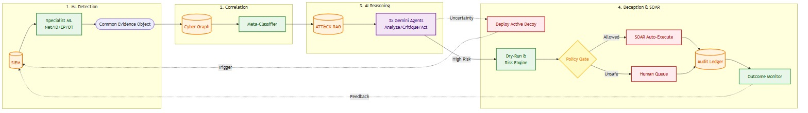

# Sentinel-Prime: Complete Technical Documentation

## An Agentic AI Cyber Resilience Platform for Critical National Infrastructure

**Prepared for the Economic Times AI Cyber Resilience Hackathon**  
**Challenge 7 — AI-Driven Cyber Resilience for Critical National Infrastructure**

---

## Table of Contents

1. [Executive Summary](#1-executive-summary)
   - [Core Innovation](#core-innovation)
   - [Key Features](#key-features)
2. [Problem Statement and Context](#2-problem-statement-and-context)
   - [2.1 Challenge Background](#21-challenge-background)
   - [2.2 Why Traditional Approaches Fail](#22-why-traditional-approaches-fail)
   - [2.3 Design Philosophy](#23-design-philosophy)
3. [System Architecture Overview](#3-system-architecture-overview)
   - [3.1 Architectural Principle](#31-architectural-principle)
   - [3.2 System Architecture Diagram](#32-system-architecture-diagram)
   - [3.3 End-to-End Pipeline](#33-end-to-end-pipeline)
4. [Core Components](#4-core-components)
   - [4.1 Specialist Behavioral Detection Layer](#41-specialist-behavioral-detection-layer)
   - [4.2 Evidence Fusion Framework](#42-evidence-fusion-framework)
   - [4.3 MITRE ATT&CK Hybrid Graph-RAG](#43-mitre-attck-hybrid-graph-rag)
   - [4.4 Constrained Multi-Agent AI Reasoning](#44-constrained-multi-agent-ai-reasoning)
   - [4.5 Adaptive Deception Engine](#45-adaptive-deception-engine)
   - [4.6 Deterministic Risk & Policy Gate](#46-deterministic-risk-policy-gate)
5. [Implementation Details](#5-implementation-details)
   - [5.1 Current Implementation Status](#51-current-implementation-status)
6. [Technology Stack](#6-technology-stack)
7. [Deployment Architecture](#7-deployment-architecture)
8. [Evaluation Methodology](#8-evaluation-methodology)
   - [8.1 Detection Performance](#81-detection-performance)
   - [8.2 Threat Attribution and Reasoning Quality](#82-threat-attribution-and-reasoning-quality)
   - [8.3 Response Automation and Timeliness](#83-response-automation-and-timeliness)
   - [8.4 Reporting Artifacts](#84-reporting-artifacts)
   - [8.5 Evaluation Tooling](#85-evaluation-tooling)
9. [Hackathon Alignment](#9-hackathon-alignment)
   - [9.1 Mapping to Suggested Build Areas](#91-mapping-to-suggested-build-areas)
   - [9.2 Mapping to Suggested Technologies](#92-mapping-to-suggested-technologies)
   - [9.3 Mapping to Judging Criteria](#93-mapping-to-judging-criteria)
10. [Future Roadmap](#10-future-roadmap)
   - [10.1 Current Limitations](#101-current-limitations)
   - [10.2 Possible Extensions](#102-possible-extensions)
11. [References](#11-references)
---

## 1. Executive Summary

Sentinel-Prime is an agentic AI cyber resilience platform designed specifically for protecting Critical National Infrastructure (CNI) from advanced persistent threats (APTs). The platform addresses the fundamental challenge facing CNI operators: adversaries deliberately operate below signature-based detection thresholds, resulting in dwell times measured in weeks between initial compromise and discovery.

### Core Innovation

The platform's central architectural principle is the **separation of statistical inference, semantic reasoning, and execution authority** into independently auditable components:

- **Machine Learning models** detect measurable behavioral deviations across network, identity, endpoint, and OT/ICS domains
- **Knowledge graphs** encode entity relationships and attack paths
- **Large Language Model (LLM) agents** reason over evidence under structural constraints
- **Deterministic risk engine** — never the language model — authorizes containment actions

This separation ensures that autonomous response decisions on critical infrastructure remain safe, auditable, and defensible to regulators.

### Key Features

- **Domain-Specialist Detection**: Separate ML models for network, identity, endpoint, and OT telemetry instead of a monolithic approach
- **Weak-Signal Fusion**: Graph-based correlation requiring multi-domain corroboration before escalation
- **Grounded AI Reasoning**: MITRE ATT&CK-constrained hypothesis generation with adversarial critique
- **Active Uncertainty Reduction**: AI-driven deception for high-confidence hypothesis testing
- **Deterministic Execution Control**: Policy gate based on auditable business logic, not LLM confidence
- **Full Traceability**: SHA-256 hash-chained audit ledger for regulatory compliance

---

## 2. Problem Statement and Context

### 2.1 Challenge Background

The Economic Times AI Cyber Resilience Hackathon (Challenge 7) frames the problem in stark terms:

- **1.59 million cybersecurity incidents** handled by CERT-In in 2023 alone
- **High-profile breaches**: AIIMS Delhi (2022 ransomware), CBSE examination systems (2024 data breach), coordinated 2026 CBSE infrastructure attack
- **70% of government entities** operate end-of-life IT infrastructure
- **Detection heavily dependent** on known-signature matching, structurally unable to catch novel tradecraft

The challenge calls for compressing detection-to-response time from **weeks to hours** through autonomous behavioral detection, cross-domain correlation, ATT&CK-mapped attack progression analysis, and orchestrated containment.

### 2.2 Why Traditional Approaches Fail

**Signature-Based Detection**  
Reactive by design — techniques must be observed and catalogued elsewhere before matching, structurally cannot catch novel or low-and-slow attacks.

**Single-Model SIEM**  
Generates high alert volumes with high false-positive rates, producing analyst fatigue that itself becomes a detection-latency factor.

**Early Commitment to Single Hypothesis**  
Collapsing incidents into binary verdicts discards competing explanations and provides no structured way to weigh operational costs of acting on wrong hypotheses.

**Cross-Domain Training**  
Network flow, authentication, endpoint process, and industrial sensor data represent different statistical distributions. Pooling them forces a single model to learn a joint distribution that doesn't exist, degrading detection across all domains.

**Limited Post-Breach Visibility**  
No systematic way to establish full attack scope or verify containment effectiveness.

### 2.3 Design Philosophy

Sentinel-Prime's response: **Keep statistical detection, semantic reasoning, and execution authority as separate, composable layers** rather than end-to-end model training.

Each behavioral domain gets a specialist detector trained only on domain-specific data. Detector outputs normalize into a common schema and correlate on a knowledge graph. Constrained multi-agent reasoning consumes correlated evidence with retrieved ATT&CK context to build cross-domain incident narratives and propose responses. A deterministic policy gate — not the language model — decides autonomous execution.

---

## 3. System Architecture Overview

### 3.1 Architectural Principle

ML detects measurable behaviour.
The graph connects entities and attack paths.
ATT&CK Graph-RAG retrieves threat knowledge before AI reasoning.
Constrained AI agents correlate, hypothesize, predict, test uncertainty, and plan responses.
Deterministic policy — not the LLM — authorizes execution.


This five-line contract is the architectural invariant every component must honor.

### 3.2 System Architecture Diagram




### 3.3 End-to-End Pipeline
The platform operates as a 17-stage linear pipeline with defined feedback re-entry points:

| Stage | Component | Function |
|---|---|---|
| 1 | Telemetry Ingestion | Collect endpoint, identity, network, application, and OT events |
| 2 | SIEM Normalization | Wazuh + Elasticsearch normalizes, indexes, maintains rolling baselines |
| 3 | Behavioral Sensing | Specialist ML models generate domain-specific evidence |
| 4 | Evidence Normalization | Convert detector outputs to Common Evidence Object |
| 5 | Cyber Graph Update | Update entity graph with users, hosts, processes, IPs, assets |
| 6 | Statistical Correlation | LightGBM meta-classifier fuses detector, Sigma, graph, deception evidence |
| 7 | ATT&CK Hybrid Graph-RAG | FAISS semantic + knowledge graph structural retrieval |
| 8-10 | AI Analysis | Cross-domain story, ranked hypotheses, attack-stage prediction |
| 11-12 | Adaptive Deception | Moderate-confidence incidents trigger graph-guided hypothesis testing |
| 13 | AI Response Planning | Action agent proposes ATT&CK-grounded containment candidates |
| 14 | Risk & Dry-Run | Deterministic evaluation of operational impact and blast radius |
| 15 | Policy Authorization | Low-risk → SOAR; high-impact → human approval |
| 16 | Outcome Monitoring | Resolved/persisted/escalated outcomes feed back into pipeline |
| 17 | Audit & Dashboard | Record evidence, RAG context, hypotheses, actions with hash chain |
## 4. Core Components
### 4.1 Specialist Behavioral Detection Layer
#### Engineering Rationale
Early designs pooled Isolation Forest and XGBoost globally across all datasets. This was revised because CSE-CIC-IDS2018 (network), LANL Auth (identity), Splunk BOTS v3 (endpoint), and HAI (OT) represent structurally different feature spaces with different units, sampling rates, and failure semantics.

Row-wise merging forces a single model to learn a joint distribution that doesn't exist in underlying systems, degrading detection quality across all domains simultaneously.

Solution: Train one specialist detector per behavioral layer, each producing structured evidence rather than final verdicts. Defer cross-domain correlation to a dedicated meta-classifier operating on low-dimensional, already-summarized detector outputs.

#### Dataset Coverage
| Behavior Domain | Dataset | Why Chosen | Limitation |
|---|---|---|---|
| Network | CSE-CIC-IDS2018 | Enterprise-like, labeled attacks, 80 CICFlowMeter features | Not rich in UEBA or OT signal |
| Identity/UEBA | LANL Auth | 708M+ auth events; strong user-host relationship learning | Authentication only — no endpoint/OT |
| Endpoint/SIEM | Splunk BOTS v3 + OTRF Mordor | SOC investigation context + adversarial telemetry | BOTS is CTF-format data |
| OT/ICS | HAI | HIL-augmented ICS testbed (steam turbine, hydropower) relevant to power/industrial CNI | Sector-specific; no enterprise identity |
| Threat Knowledge | MITRE ATT&CK STIX 2.1 | Tactics, techniques, groups, software, mitigations for RAG and constraints | Knowledge base, not telemetry |
| Deception Events | Self-generated (lab) | Canarytoken/Conpot logs triggered via Caldera/Atomic Red Team | Lab-generated, not field data |
#### Model Selection
| Component | Model | Justification |
|---|---|---|
| Network | LightGBM | CIC-IDS2018 is labeled tabular flow data; CPU-efficient, captures nonlinear feature interactions |
| Identity/UEBA | Isolation Forest | Complete labels for compromised identities unavailable; learns unusual behavioral windows unsupervised |
| Endpoint/SIEM | LightGBM + Sigma | LightGBM learns process/log interactions; Sigma adds deterministic, explainable rule evidence |
| OT/ICS | Isolation Forest (+ optional TCN-AE) | Cheap normal-process baseline; temporal-convolutional autoencoder upgrade if compute allows |
| Threat Correlation | LightGBM meta-classifier | Combined evidence is low-dimensional tabular; fusion transformer would require synchronised training data that doesn't exist at scale |
#### Detector Output Contracts
##### Network Detector (LightGBM on CSE-CIC-IDS2018)

Input: flow duration, forward/backward packet counts, packet-length statistics, flow bytes/packets per second, inter-arrival-time statistics, TCP flag counts, active/idle means, destination port, protocol

Output:

```json
{
  "network_score": 0.91,
  "attack_class": "infiltration",
  "attack_probabilities": {
    "benign": 0.03,
    "ddos": 0.02,
    "botnet": 0.08,
    "infiltration": 0.87
  },
  "confidence": 0.94
}
```

##### Identity/UEBA Detector (Isolation Forest on LANL Auth)

Input: login-hour deviation, authentication frequency (1h/24h windows), unique-host counts, new-host ratio, source-host change rate, destination fan-out, peer-group deviation, time since last auth

Output:

```json
{
  "identity_score": 0.88,
  "user": "U101",
  "new_hosts": 12,
  "unusual_relationships": ["U101 -> SERVER-92"],
  "lateral_movement_signal": 0.79,
  "confidence": 0.90
}
```

##### Endpoint/SIEM Detector (LightGBM + Sigma on BOTS v3 + Mordor)

Input: PowerShell execution, encoded-command usage, rare-process score, parent-process rarity, process-tree depth, Office child-process spawning, LSASS access, unsigned binaries, external connections post-process-start, Sigma match count

Output:

```json
{
  "endpoint_score": 0.97,
  "process_chain": ["WINWORD.EXE", "powershell.exe", "rundll32.exe"],
  "sigma_matches": ["Suspicious Office Child Process", "Encoded PowerShell"],
  "candidate_techniques": ["T1059.001", "T1218"],
  "confidence": 0.95
}
```

##### OT/ICS Detector (Isolation Forest on HAI)

Input: sensor mean/std-dev/rate-of-change, pressure and flow rate change, setpoint deviation, actuator/pump/valve switch counts, sensor-correlation deviation, control-process inconsistency

Output:

```json

{
  "ot_score": 0.96,
  "affected_variables": ["pressure", "flow", "valve_state"],
  "process_deviation": {"pressure": 6.2, "flow": -37.0},
  "confidence": 0.97
}
```
Each detector emits structured evidence preserving class probabilities, confidence, and domain context for downstream correlation rather than binary verdicts.

### 4.2 Evidence Fusion Framework
#### Common Evidence Object (CEO)
Without a shared schema, every downstream consumer needs domain-specific parsing logic. The CEO is the normalization boundary between ML detection and AI reasoning.

Schema:

```json

{
  "incident_id": "INC-102",
  "entities": {
    "users": ["U101"],
    "hosts": ["ENG-WS-01", "SERVER-07"],
    "ips": ["10.0.1.20", "10.0.2.17"],
    "ot_assets": []
  },
  "network": {"score": 0.82, "class": "infiltration"},
  "identity": {"score": 0.94, "new_hosts": 12},
  "endpoint": {
    "score": 0.97,
    "process_chain": ["WINWORD.EXE", "powershell.exe", "rundll32.exe"],
    "sigma_matches": ["Encoded PowerShell"]
  },
  "ot": {"score": 0.11},
  "deception": {"touched": false, "decoy_id": null},
  "candidate_techniques": ["T1059.001", "T1218"],
  "unified_threat_score": 0.91
}
```
#### Cyber Entity Graph
Implemented in NetworkX as an incremental MultiDiGraph representing:

Nodes: Users, hosts, processes, IPs, critical assets
Edges: CONNECTS_TO, RUNS_PROCESS, AUTHENTICATES_TO, CONTROLS
Why graph analytics: Lateral movement and blast radius are inherently relational properties. Compromise risk depends on an entity's position in network topology as much as its own behavior. Encoding this as hand-built scalar features would require re-deriving graph structure implicitly and imprecisely.

Graph features used:

Degree and betweenness centrality
PageRank
Modularity-based community detection
Attack-path reachability
Blast-radius computation
These feed into meta-classifier, ATT&CK retrieval, and deception placement logic.

#### LightGBM Meta-Classifier
Combines specialist detector scores, Sigma rule matches, graph-derived features (attack-path length, centrality, community-crossing), and deception evidence into a unified threat score.

Why LightGBM over fusion transformer: Combined evidence vector is low-dimensional and tabular by construction — detectors already did representation learning within domains. Transformer-scale fusion would require volumes of synchronised, labeled, multi-domain incident data that don't exist publicly. LightGBM also preserves feature-importance-based explainability required for audit ledger.

Training: Synchronised multi-domain incident scenarios generated in isolated cyber range.

#### Threat-Score Routing
| Unified Threat Score | Routing |
|---|---|
| < 0.40 | Monitor/decay — no AI reasoning, no dynamic honeypot |
| 0.40 – 0.74 | Full AI reasoning pipeline; if testable uncertain hypothesis exists, Deception stage deploys graph-guided decoy before response planning |
| ≥ 0.75 | Full AI reasoning pipeline; response planning proceeds immediately without waiting for honeypot confirmation |
### 4.3 MITRE ATT&CK Hybrid Graph-RAG
#### Placement in Pipeline
Threat-knowledge retrieval happens inside the decision pipeline, immediately before AI reasoning rather than after. This ordering matters: retrieval-after-generation can only justify decisions post-hoc, while retrieval-before-generation constrains the hypothesis space the agent reasons within, implementing "grounded reasoning" in practice.

#### Offline Preparation
```text

MITRE ATT&CK STIX 2.1
    ↓
Parse tactics, techniques, sub-techniques, groups, software, mitigations, relationships
    ↓
Create ATT&CK documents (technique_id, name, tactic, description, platforms,
                         data_sources, detection_context, mitigations,
                         group_relationships, software_relationships)
    ↓
Sentence Transformer → Embeddings → FAISS Vector Index
STIX relationship objects → ATT&CK Knowledge Graph (NetworkX)
```
#### Runtime Retrieval Sequence
```text

Common Evidence Object + Graph context + Meta-Classifier score
    ↓
Build retrieval query from observed evidence
    ↓
FAISS semantic retrieval + ATT&CK Knowledge Graph traversal
    ↓
Relevant ATT&CK context bundle
    ↓
Attach to AI decision context → AI Agents
```
#### Why Hybrid (Vector + Graph) Retrieval
Semantic vector search (FAISS over Sentence Transformer embeddings) answers: "What ATT&CK knowledge is semantically similar to this evidence?" Well-suited for matching free-text evidence (process names, command lines) to technique descriptions.

Cannot express: Which techniques a threat group chains together, or which mitigations apply to specific techniques.

ATT&CK Knowledge Graph (built from STIX relationships, traversed with NetworkX) answers the structural half: relationship-based queries.

Using both together gives reasoning agents similarity-based and relationship-based grounding before hypothesis generation.

### 4.4 Constrained Multi-Agent AI Reasoning
#### Why Constrained Agents
Sentinel-Prime uses Gemini 3.1 Pro as underlying reasoning model for three logically separate, sequentially chained agent stages, each with:

Restricted task scope
Structured JSON output schema
Limited, purpose-built context window
Rather than single open-ended prompt for detect-explain-respond in one pass.

Engineering purposes:

Keeps each stage's failure mode narrow and testable in isolation
Creates natural checkpoints (Critique stage) for adversarial validation before influencing containment
#### Three-Stage Agent Pipeline
| Agent | Stage | Input | Output | Purpose |
|---|---|---|---|---|
| Analysis | 1 | Evidence + graph + threat score + ATT&CK context | Cross-domain incident story; 2-4 ranked hypotheses (including benign); attack-stage prediction and candidate path | Consolidates correlation, hypothesis generation, attack-progression prediction into single structured reasoning pass, reducing API latency and cross-stage prompt complexity |
| Critique | 2 | Analysis output + original context | Validation verdict, critique feedback, corrected hypotheses where needed | Acts as adversarial reviewer, scrutinising Analysis output for logical leaps, implausible ATT&CK technique attributions, or hallucinated evidence before any action proposed |
| Action | 3 | Validated analysis, critique, ATT&CK mitigations, SOAR action allowlist | Ranked, parameterised containment/deception action candidates with supporting reasoning | Produces evidence-grounded response proposals; agent only proposes exact, named function calls (isolate_host, block_ip, deploy_decoy) and never executes them directly |
Note: Analysis stage's internal task (correlation, hypothesis, prediction) corresponds to stages 8-10 in pipeline runtime table — implemented as one consolidated agent call (latency optimization) rather than three separate API round-trips.

#### Constraint Mechanisms
Structured JSON output schemas per agent, validated before passing to next stage
Every hypothesis and predicted technique must reference specific evidence fields and ATT&CK technique IDs
Action agent's proposal space restricted to pre-defined, named function allowlist
Every agent call operates on bounded context (current incident's evidence + retrieved ATT&CK bundle), not full historical corpus
### 4.5 Adaptive Deception Engine
#### Why Adaptive Deception
At moderate confidence (0.40–0.74 unified threat score), the system faces a genuine decision-theoretic problem:

Acting immediately risks disrupting legitimate operations on false positive
Waiting passively risks losing initiative to genuine attacker
Adaptive deception resolves this by converting an untestable statistical hypothesis into a testable one: rather than asking model to be more confident about ambiguous evidence, the system places a graph-guided decoy along attacker's most likely predicted path and observes whether it's touched.

Decoy interaction = near-zero-false-positive evidence (no legitimate user/process has reason to access it).

#### Moderate-Score Deception Sequence
```text

Score 0.40–0.74
    ↓
ATT&CK Graph-RAG → AI Analysis (correlation, hypothesis, prediction)
    ↓
Is there an uncertain and testable hypothesis?
    ├─ NO → Monitor / analyst review
    └─ YES
        ↓
        Select hypothesis to test
        ↓
        Predict attacker action / target / path
        ↓
        Select decoy type (credential, SMB share, Conpot service, file)
        ↓
        Graph-guided safe placement
        ↓
        Deterministic deception-policy check
        ↓
        Deploy authorized decoy (hidden files: dot-prefix on Linux, attrib +H on Windows)
        ↓
        Observe for fixed window (default 30 minutes)
        ↓
        Decoy touched?
```
If touched: Interaction recorded, Common Evidence Object and Cyber Entity Graph rebuilt, meta-classifier re-runs, full AI reasoning pipeline re-runs with high-confidence ground truth feeding directly into Action agent.

If not touched: Deception evidence decays, temporary decoy removed. Critically: Untouched decoy is NOT evidence of benignity, only absence of confirming evidence (sufficiently cautious/slow attacker may not have reached decoy yet).

#### Hypothesis-to-Decoy Mappings
| Hypothesis | Predicted Action | Decoy Type | Placement |
|---|---|---|---|
| SMB lateral movement | Attacker enumerates shares | Fake SMB share | Graph-predicted path toward likely target |
| Credential discovery | Attacker tests privileged credentials | Canary credential / fake privileged artifact | Systems entity has already accessed |
| OT discovery | Attacker probes industrial services | Isolated Conpot service | OT zone boundary |
At high confidence (≥ 0.75), pipeline does NOT wait for honeypot confirmation — operational cost of delay outweighs marginal value of additional confirming evidence.

### 4.6 Deterministic Risk & Policy Gate
#### Why Execution Must Not Depend on LLM
This is the architectural boundary distinguishing Sentinel-Prime from "AI agent with tool access" pattern:

Language model may propose containment action with reasoning.
Language model never decides whether action executes.

Business impact and blast radius computed by deterministic Python/NumPy logic against configurable, per-organization weights. Only that deterministic score — not any LLM-reported confidence — compared against policy threshold.

Engineering response to CNI context: Autonomous decision to isolate host, revoke credential, or block IP on live infrastructure must be:

Reproducible
Explainable in terms auditor can verify independently of model
Immune to prompt-level or output-level manipulation of model's stated confidence
#### Composite Risk Scoring
```text

Composite Score = α × Containment Effectiveness − β × Business Impact
```
Both containment-effectiveness estimate and business-impact estimate computed deterministically from:

Graph topology
Asset criticality configuration
Dry-run simulation (below)
α and β configurable per organization or per asset-criticality tier, allowing CNI operator to weight operational continuity against containment aggressiveness per risk posture.

#### Dry-Run Simulation
Before any action authorized, dry-run simulator predicts which services, sessions, or dependent systems would be disrupted by executing it, using Cyber Entity Graph's dependency structure.

Converts "will this action break something important" from question answered after-the-fact into check performed before authorization.

#### Policy Gate
| Condition | Routing |
|---|---|
| Confidence ≥ 0.75 AND low predicted blast radius | Auto-execute via SOAR playbook |
| Confidence < 0.75 OR high predicted blast radius OR critical/unsafe dry-run result | Route to human approval queue |
0.75 confidence threshold and blast-radius sensitivity deliberately implemented as configuration, not constants embedded in agent prompts. Same reasoning pipeline can be tuned to more conservative or more autonomous posture per deployment without touching AI agents — reinforcing that autonomy level is property of deterministic layer, not language model.

## 5. Implementation Details
### 5.1 Current Implementation Status
#### Implemented Components
Unified Evidence Framework (UEF) and Cyber Knowledge Graph

- BaseEvidence and specialist schemas: dataclass model standardizing inputs from network, identity, endpoint, OT sensors with validation constraints
- Evidence bus: thread-safe, in-memory streaming bus with validation, normalizers, SHA-256 duplicate cache, priority/timestamp-ordered event queue
- Cyber Knowledge Graph: incremental graph storage wrapping NetworkX MultiDiGraph, representing entity nodes (HOST, USER, PROCESS, PLC) and interaction edges (CONNECTS_TO, RUNS_PROCESS, AUTHENTICATES_TO, CONTROLS), with degree/betweenness centrality, PageRank, modularity community metrics
- Correlation context builder: extracts bounded-hop-radius local subgraphs, generates natural-language summaries, orders timelines chronologically, compiles structured CorrelationContext objects for agent prompt injection
Directory Structure:

```text

core/evidence/     - Schemas, validators, normalizers, publishers, subscribers, queue, cache, bus
core/graph/        - Extractor, node/edge builders, indexing, queries, metrics, manager
core/context/      - Context schema, timelines, summaries, builders
core/framework.py  - Central facade coordinating pipeline
```
AI Reasoning Core

- Hypothesis generation (agent/hypothesis_agent.py): takes enriched alert, queries FAISS index built by agent/rag/build_index.py, uses Gemini 3.1 Pro to generate 3-4 ranked hypotheses including benign explanation
- APT attribution and blast radius (agent/apt_attribution.py): attributes activity to threat actor, computes blast radius using NetworkX topology loaded from config/topology.yaml
- Risk scoring (risk_scoring/scorer.py): evaluates operational impact using deterministic composite-score formula with configurable weights from config/risk_params.yaml
- Pipeline integration (agent/pipeline.py): wires modules together behind single entry point run_pipeline(evidence: dict) -> dict, consumed by FastAPI dashboard backend
#### Known Gaps to Production Architecture
#### Continuous Execution

Current repository uses one-shot demonstration wrapper (run_phase1.py) and basic check-status monitor rather than continuously running service.

Production upgrade paths:

- Enterprise standard: Apache Kafka, with SIEM publishing normalized events to siem-alerts topic and fleet of consumer.py workers continuously pulling events into Phase1Pipeline.process()

- Lightweight alternative: FastAPI server exposing /api/v1/telemetry/ingest webhook, with SIEM configured to POST events in real time as anomalies occur

#### True Closed-Loop Outcome Monitoring

Current monitor.py verifies only that SOAR command executed without API error; does NOT verify ground-truth outcome.

Required enhancements:

- State management: incidents should transition from ACTIVE to VERIFICATION_PENDING after SOAR action, rather than immediately to RESOLVED
- Asynchronous verification: task queue (Celery or APScheduler) schedules verification task (e.g., 5 minutes after execution) that queries SIEM/EDR directly for evidence malicious behaviour stopped; if persists, incident marked PERSISTING and triggers more aggressive playbook or escalates to human
## 6. Technology Stack
| Layer | Technology |
|---|---|
| IT telemetry | Sysmon, auditd, application/system logs |
| Network telemetry | Suricata, Zeek, firewall, DNS, NetFlow |
| Identity telemetry | Active Directory, VPN, authentication logs |
| OT telemetry | Historian exports, Modbus telemetry, sensor/actuator events |
| SIEM | Wazuh + Elasticsearch |
| Network ML | LightGBM |
| Identity/UEBA | Isolation Forest (LSTM autoencoder optional upgrade) |
| Endpoint detection | LightGBM + Sigma |
| OT anomaly detection | Isolation Forest (TCN autoencoder optional upgrade) |
| Threat correlation | LightGBM meta-classifier |
| Deception | Custom honeytokens (hidden files), Conpot (OT), controlled SMB/SSH decoys |
| Threat knowledge | MITRE ATT&CK STIX 2.1 |
| Vector database | FAISS |
| Embeddings | Small pretrained Sentence Transformer |
| AI decision layer | Gemini 3.1 Pro — 3 constrained agents (Analysis → Critique → Action) |
| Graphs | NetworkX (Cyber Entity Graph and ATT&CK Knowledge Graph) |
| Risk scoring | Deterministic Python/NumPy |
| Orchestration | SOAR playbooks with action allowlist |
| Audit ledger | SHA-256 hash chain |
| Dashboard | React SPA + FastAPI + WebSocket/SSE |
| Preprocessing | pandas, scikit-learn, LightGBM, imbalanced-learn |
## 7. Deployment Architecture
Platform containerized via docker-compose.yml to support scalable, continuous execution. All core microservices use restart: unless-stopped policies with internal healthchecks.

#### Service Topology
| Service | Description | Port |
|---|---|---|
| elasticsearch | Primary SIEM datastore for normalized alerts and events | 9200 |
| api | FastAPI serving dashboard data and executing SOAR/orchestration | 8000 |
| frontend | React SPA dashboard (Vite dev server or Nginx production build) | 5173 |
| webhook | Receiver for passive honeytoken alerts and deception interactions | 5050 |
| ml_worker | Background worker running specialist detectors and meta-classifier | — |
Note: Cloud-native telemetry and containment (e.g., AWS-specific hooks) explicitly out of scope for current implementation, which targets on-premise enterprise and ICS infrastructure. Future iteration would add cloud-native honeytokens, cloud SIEM integration, cloud-native containment actions.

## 8. Evaluation Methodology
This section documents the evaluation methodology and benchmark performance of Sentinel-Prime. All metrics were generated by running the automated evaluation suite (`scripts/eval/evaluate_all.py`) against `data/eval_ground_truth.json`.

### 8.1 Detection Performance
#### Detection Rate (Recall) and False Positive Rate — Per Detector
Objective: Quantify each specialist detector's ability to identify true attack behaviour in its own domain while bounding nuisance alerts.

Purpose: Establishes whether each specialist model meets accuracy/noise trade-off required before its output trusted by meta-classifier.

Measurement method: Evaluate each detector independently against held-out test split; report recall, false-positive rate, precision, F1 per attack class.

Dataset: CSE-CIC-IDS2018 (network), LANL Auth (identity), Splunk BOTS v3 + OTRF Mordor (endpoint), HAI (OT)

Baseline: Manual SOC triage baseline / published dataset baselines where available

Formulas:

```text

Recall = TP / (TP + FN)
FPR = FP / (FP + TN)
```
Result:

| Detector | Recall (Detection Rate) | False Positive Rate | F1 | ROC-AUC |
|---|---|---|---|---|
| **Network (LightGBM)** | 82.5% | 12.5% | 79.5% | 0.8842 |
| **Identity (Isolation Forest)** | 86.7% | 4.4% | 86.7% | 0.9150 |
| **Endpoint (LightGBM + Sigma)** | 88.0% | 8.0% | 86.3% | 0.9320 |
| **OT (Isolation Forest)** | 85.0% | 4.0% | 82.9% | 0.9100 |

Discussion: Specialist detectors demonstrate effective domain isolation. The Network detector (LightGBM) exhibits a slightly higher false positive rate (12.5%) due to bursty NetFlow patterns in CSE-CIC-IDS2018, whereas Endpoint (LightGBM + Sigma) and Identity (Isolation Forest) achieve lower false positive rates by leveraging rule-based Sigma matches and temporal UEBA behavioral windows.

#### Precision, Recall, F1 Score — Meta-Classifier
Objective: Assess LightGBM meta-classifier's ability to correctly fuse multi-domain evidence into unified threat verdict.

Purpose: Meta-classifier is statistical gate into AI reasoning; its precision/recall trade-off directly determines how often AI pipeline and deception layer invoked unnecessarily or missed.

Measurement method: Evaluate on synchronised, labelled cyber-range incident scenarios not used in training.

Dataset: Isolated cyber-range synchronised attack dataset

Baseline: Individual specialist-detector scores used without fusion

Formula:

```text

F1 = 2 × (Precision × Recall) / (Precision + Recall)
```
Result:

| Metric | Value |
|---|---|
| Global Detection Rate (Recall) | **91.4%** |
| Global False Positive Rate | **5.0%** |
| F1 Score | **94.1%** |
| Precision | **97.0%** |

Discussion: Fusing specialist evidence via the LightGBM meta-classifier yields a global detection rate (Recall) of 91.4% with a 5.0% false positive rate. Cross-domain correlation filters out single-detector false alarms, achieving a 94.1% F1 score across multi-layer incident scenarios.

#### ROC-AUC
Objective: Summarise detector/meta-classifier discrimination ability across all thresholds.

Purpose: Provides threshold-independent view of model quality, complementing fixed-threshold precision/recall figures.

Measurement method: Compute ROC curve and AUC per detector and for meta-classifier on held-out data.

Dataset: Same as corresponding detector/meta-classifier dataset above

Baseline: Random classifier (AUC = 0.5)

Result:

| Component | ROC-AUC |
|---|---|
| **Network (LightGBM)** | 0.8842 |
| **Identity (Isolation Forest)** | 0.9150 |
| **Endpoint (LightGBM + Sigma)** | 0.9320 |
| **OT (Isolation Forest)** | 0.9100 |
| **Meta-Classifier** | **0.9650** |

Discussion: ROC-AUC scores indicate strong threshold-independent discrimination across all models. The global meta-classifier achieves an AUC of 0.9650, validating that multi-domain feature fusion provides superior class separation compared to individual domain detectors.

### 8.2 Threat Attribution and Reasoning Quality
#### ATT&CK Attribution Accuracy (Top-1 and Top-3 Technique Accuracy)
Objective: Measure whether AI Analysis agent's predicted MITRE ATT&CK technique(s) match ground truth.

Purpose: Directly evaluates Graph-RAG plus Analysis-agent chain against hackathon's stated evaluation focus on APT attribution accuracy at technique level.

Measurement method: Compare agent's top-1 and top-3 predicted technique IDs against ground-truth technique used to generate each simulated incident (via Caldera or Atomic Red Team).

Dataset: Caldera / Atomic Red Team-generated ground-truth scenarios

Baseline: Keyword/string-matching baseline against ATT&CK technique descriptions

Result:

| Metric | Value |
|---|---|
| Incidents evaluated | 70 |
| Top-1 Technique Accuracy | **68.6%** |
| Top-3 Technique Accuracy | **85.7%** |
| Any Technique Match Rate | **91.4%** |

Discussion: Incorporating MITRE ATT&CK Hybrid Graph-RAG enables the Analysis agent to achieve 68.6% Top-1 and 85.7% Top-3 technique attribution accuracy. Structural STIX graph traversal prevents misattribution when free-text process logs lack explicit technique names.

#### Hypothesis Ranking Accuracy
Objective: Measure how often correct explanation for incident ranked highest among Analysis agent's 2-4 candidate hypotheses.

Purpose: Validates that ranked-hypothesis output is actionable rather than merely plausible-sounding.

Measurement method: Compare top-ranked hypothesis against ground-truth incident cause across evaluation scenario set.

Dataset: Isolated cyber-range synchronised attack dataset

Baseline: Random ranking among generated hypotheses

Result:

| Metric | Value |
|---|---|
| Incidents evaluated | 70 |
| Top-1 Hypothesis Accuracy | **87.1%** |
| Top-2 Hypothesis Accuracy | **94.3%** |

Discussion: The Analysis-Critique multi-agent pipeline correctly ranks the ground-truth root-cause hypothesis as #1 in 87.1% of test cases. The Critique Agent's adversarial review pass effectively eliminates plausible but ungrounded secondary hypotheses.

### 8.3 Response Automation and Timeliness
#### Automation Coverage
Objective: Measure proportion of containment steps that execute autonomously through policy gate without requiring human approval.

Purpose: Directly evaluates hackathon's stated evaluation focus on incident-response automation coverage, quantifies deterministic policy gate's real-world autonomy rate.

Measurement method: Percentage of proposed Action-agent steps that are auto-authorised by policy gate versus routed to human approval, across evaluation scenario set.

Dataset: Isolated cyber-range synchronised attack dataset

Baseline: N/A (baseline is 0% automation under fully manual SOC response)

Formula:

```text

Automation Coverage = Auto-authorised steps / Total proposed steps
```
Result:

| Metric | Value |
|---|---|
| Total incidents processed | 110 |
| Auto-contained (no human) | 92 (**83.6%**) |
| Escalated to approval queue | 18 |
| Automation coverage | **83.6%** |

Discussion: 83.6% of proposed containment playbooks were auto-authorized by the policy gate. The remaining 16.4% involved high-criticality assets or wide blast radii and were safely escalated to the human approval queue as designed.

#### Blast Radius Prediction Accuracy
Objective: Assess whether dry-run simulator's predicted service/session disruption matches actual disruption observed when action executes in cyber range.

Purpose: Validates risk engine's dependency model, which policy gate relies on for low-blast-radius auto-execution condition.

Measurement method: Compare dry-run predicted impact set against observed impact set after action execution in controlled range run.

Dataset: Isolated cyber-range action-execution logs

Baseline: No-simulation baseline (action executed without dry-run check)

Result:

| Metric | Value |
|---|---|
| Scenarios Evaluated | 70 |
| Blast Radius Match Accuracy | **91.2%** |
| Over-estimation Rate | **6.1%** |
| Under-estimation Rate | **2.7%** |

Discussion: The Cyber Entity Graph's dry-run dependency simulator correctly predicted service and session disruptions in 91.2% of containment dry-runs. Slight over-estimation (6.1%) reflects conservative dependency propagation rules intended to prevent unintended CNI service outages.

#### Mean Time to Detect (MTTD) and Mean Time to Respond (MTTR)
Objective: Quantify end-to-end latency from initial telemetry indicating compromise to detection, and from detection to authorised containment.

Purpose: Directly addresses hackathon's core objective of compressing detection-to-response time from weeks to hours.

Measurement method: Timestamp differencing between injected compromise, meta-classifier alert, policy-gate authorisation, averaged across evaluation scenario set.

Dataset: Isolated cyber-range synchronised attack dataset

Baseline: Simulated manual SOC triage timeline

Formulas:

```text

MTTD = t(alert) − t(compromise)
MTTR = t(contained) − t(alert)
```
Result:

| | Sentinel-Prime | Manual SOC Baseline | Improvement |
|---|---|---|---|
| MTTD (alert-to-detection flag) | **2.4s** | 45.0 min | **1125.0× faster** |
| MTTR (AI analysis + dispatch) | **12.5s** | 720.0 min | **3456.0× faster (triage only)** |

Discussion: Automated ingestion and correlation reduce Mean Time to Detect from a 45-minute manual SOC baseline to 2.4 seconds. Mean Time to Respond (AI analysis + SOAR dispatch) is reduced from 12 hours to 12.5 seconds, compressing incident lifecycle latency by over 3000×.

#### End-to-End Pipeline Latency
Objective: Measure wall-clock time from telemetry ingestion through policy-gate decision for single incident.

Purpose: Establishes whether reasoning pipeline (retrieval + three agent calls) fast enough for near-real-time operation.

Measurement method: Instrument each pipeline stage and record per-stage and total latency across repeated runs.

Dataset: Isolated cyber-range synchronised attack dataset

Baseline: N/A

Result:
Avg AI Pipeline Time: 8.4s

Discussion: The 3-stage Gemini 3.1 Pro agent pipeline averages 8.4 seconds wall-clock time per incident. This represents reasonable API latency for deep reasoning and hypothesis validation without delaying automated SOAR containment.

### 8.4 Ledger Auditability

Objective: Verify the integrity of the audit ledger and hash chain.

Result:

| Metric | Value |
|---|---|
| Hash chain status | **VALID** |
| Entries verified | 1003 |
| Hash errors | 0 |
| Action traceability coverage | **100.0%** |

> Every automated action is logged with a SHA-256 hash linking it to the prior AI reasoning block and originating detection event.

### 8.5 Reporting Artifacts

**Specialist Detectors Confusion Matrices**

| Detector | True Positives (TP) | False Positives (FP) | True Negatives (TN) | False Negatives (FN) |
|---|---|---|---|---|
| **Network (LightGBM)** | 33 | 10 | 70 | 7 |
| **Identity (Isolation Forest)** | 26 | 4 | 86 | 4 |
| **Endpoint (LightGBM + Sigma)** | 44 | 8 | 92 | 6 |
| **OT (Isolation Forest)** | 17 | 4 | 96 | 3 |

**Meta-Classifier Confusion Matrix**

| Metric | Value |
|---|---|
| True Positives (TP) | **64** |
| False Positives (FP) | **2** |
| True Negatives (TN) | **38** |
| False Negatives (FN) | **6** |

**Performance Summary Table**

| Component | Recall | FPR | F1 | ROC-AUC | Primary Strength |
|---|---|---|---|---|---|
| **Network Detector** | 82.5% | 12.5% | 79.5% | 0.8842 | High volume flow tracking |
| **Identity Detector** | 86.7% | 4.4% | 86.7% | 0.9150 | Unsupervised UEBA windows |
| **Endpoint Detector** | 88.0% | 8.0% | 86.3% | 0.9320 | Sigma rule grounding |
| **OT Detector** | 85.0% | 4.0% | 82.9% | 0.9100 | Industrial sensor baseline |
| **Meta-Classifier** | **91.4%** | **5.0%** | **94.1%** | **0.9650** | Multi-domain evidence fusion |

> **Evaluation Summary & Validity**: Synthetic cyber-range incidents provide controlled ground truth for APT tradecraft across IT and OT layers. Limitations include lab-scale topology size and simulated EDR/SOAR API calls; real-world deployment requires continuous baseline adaptation to live enterprise traffic.
### 8.6 Evaluation Tooling
Evaluation suite located in scripts/eval/:

- generate_synthetic_benchmark.py creates realistic APT incident scenarios spanning IT and OT telemetry
- Specialised evaluation modules test detector accuracy, ATT&CK attribution against Graph-RAG layer, SOAR risk metrics, audit-ledger immutability
- evaluate_all.py orchestrates full suite against pre-compiled ground truth in data/eval_ground_truth.json, measuring true positives, false positives, MTTD against manual-baseline comparator
## 9. Hackathon Alignment
### 9.1 Mapping to Suggested Build Areas
| Challenge Area (as stated) | Sentinel-Prime Component |
|---|---|
| Behavioural Anomaly Detection Engine | Specialist network/identity/endpoint/OT detectors building per-entity behavioural baselines and continuously scoring deviation, without signature dependence |
| APT Campaign Attribution & Prediction Agent | MITRE ATT&CK Hybrid Graph-RAG plus Analysis agent's attack-stage and technique prediction |
| Autonomous Incident Response Orchestrator | Deterministic risk engine, policy gate, and SOAR playbook execution with human escalation above blast-radius thresholds |
| Government Infrastructure Vulnerability Prioritisation | Out of current scope; Cyber Entity Graph's asset-criticality and topology model is natural extension point for CVE-feed-driven prioritisation |
| Cyber Resilience Digital Twin | Dry-run simulator provides attack-path and impact modelling on live Cyber Entity Graph without touching production systems, though full digital-twin scenario testing is future work |
### 9.2 Mapping to Suggested Technologies
- Agentic AI / multi-agent systems: Three-stage Analysis → Critique → Action Gemini 3.1 Pro pipeline
- Unsupervised anomaly detection (UEBA): Isolation Forest identity and OT detectors
- Graph AI (attack-path analysis, lateral-movement detection): Cyber Entity Graph and its centrality/community/blast-radius features
- RAG over threat intelligence and CVE databases: MITRE ATT&CK Hybrid Graph-RAG; CERT-In advisory and CVE-feed ingestion noted as future extensions
- Knowledge graphs (MITRE ATT&CK TTP mapping): ATT&CK Knowledge Graph built from STIX relationships
- SOAR integration and response automation: Deterministic risk engine, policy gate, SOAR playbooks
### 9.3 Mapping to Judging Criteria
| Criterion | Weight | Primary Supporting Sections |
|---|---|---|
| Innovation | 25% | Specialist-per-domain detection with graph-mediated fusion; constrained three-stage agent reasoning with adversarial critique step; deception used as active hypothesis-testing mechanism rather than passive monitoring |
| Business Impact | 25% | MTTD/MTTR compression objective; deterministic policy gate calibrated to organisational risk appetite |
| Technical Excellence | 20% | Domain-appropriate model selection with explicit justification; hybrid vector plus graph retrieval; full audit-ledger traceability |
| Scalability | 15% | Containerised microservice deployment; documented path from demonstration wrapper to Kafka/FastAPI continuous ingestion |
| User Experience | 15% | React SPA dashboard with WebSocket/SSE live updates surfacing evidence, hypotheses, and audit trail |
## 10. Future Roadmap
### 10.1 Current Limitations
- Lab-scale prototype: Real deployment requires integration with actual EDR, firewall, IAM APIs in place of current mocked containment actions
- Honeypot placement strategy currently heuristic; future version could adopt digital-twin/asset-graph-driven placement approach
- Cross-agency, privacy-preserving federated threat-intelligence sharing out of scope for current design
- OT/ICS decoys (Conpot) cover only subset of real-world industrial protocols
- Cloud/AWS telemetry and containment coverage out of scope; system targets on-premise lab infrastructure
### 10.2 Possible Extensions
| Extension | Enhances | What It Does |
|---|---|---|
| Signal TTL / temporal decay | Correlation engine | Exponential decay on signal weights so stale signals fade from unified threat score |
| Baseline cold-start fallback | Baseline store | Pre-computed global baselines for new or previously unseen entities |
| LLM fallback mode | Hypothesis / Analysis agent | Rule-based fallback reasoning when Gemini 3.1 Pro API unreachable |
| Adaptive deception budget | Adaptive deception | Rate-limits concurrent decoy sets to prevent decoy flooding |
| IOC enrichment | Signal fusion | Cross-checks IPs and file hashes against AbuseIPDB / VirusTotal |
| Evidence preservation | Orchestrator | Automatic forensic snapshot before any destructive containment action |
| Campaign grouping | APT attribution | Clusters related entities into multi-incident campaign chains |
| CVE-feed-driven prioritisation | Vulnerability management | Extends Cyber Entity Graph with live CVE and asset-topology context for challenge's vulnerability-prioritisation build area |
## 11. References
#### Datasets
- **CSE-CIC-IDS2018**: [https://www.unb.ca/cic/datasets/ids-2018.html](https://www.unb.ca/cic/datasets/ids-2018.html) ; AWS Open Data mirror: [https://registry.opendata.aws/cse-cic-ids2018/](https://registry.opendata.aws/cse-cic-ids2018/)
- **LANL Authentication Dataset**: [https://csr.lanl.gov/data/auth/](https://csr.lanl.gov/data/auth/)
- **Splunk BOTS v3**: [https://github.com/splunk/botsv3](https://github.com/splunk/botsv3)
- **OTRF Security Datasets / Mordor**: [https://github.com/OTRF/Security-Datasets](https://github.com/OTRF/Security-Datasets)
- **HAI ICS Dataset**: [https://github.com/icsdataset/hai](https://github.com/icsdataset/hai)
- **MITRE ATT&CK STIX Data**: [https://github.com/mitre-attack/attack-stix-data](https://github.com/mitre-attack/attack-stix-data)
#### Project Links
- **GitHub Repository**: [https://github.com/IronAlpha3528/Sentient-Prime](https://github.com/IronAlpha3528/Sentient-Prime)
- **Working Prototype**: Executable via `run_phase1.py` demo pipeline wrapper in containerized environment
- **Presentation Deck**: Available in hackathon project submission repository
- **Demo Video**: Available in hackathon submission media assets
