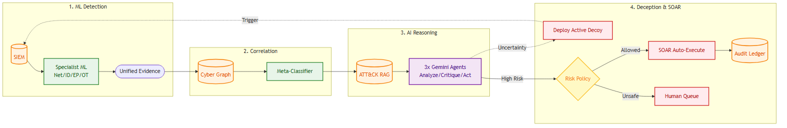

# Sentinel-Prime — Agentic AI Cyber Resilience Platform

A hybrid, AI-centric cyber resilience and autonomous threat containment platform for critical national infrastructure. Combines **specialist ML detectors** (LightGBM, Isolation Forest) monitoring network, identity, endpoint, and OT behavior, with an **adaptive deception layer** (honeypots/honeytokens) providing near-zero-false-positive compromise signals. Evidence is correlated using a **LightGBM meta-classifier**, then evaluated by **3 constrained Gemini 3.1 Pro AI agents** in a sequential Analysis → Critique → Action pipeline powered by **MITRE ATT&CK Hybrid Graph-RAG** to analyze threats, predict next-stage attacks, test hypotheses via adaptive deception, and plan containment — all authorized by a **deterministic policy gate**, never the LLM.

Built for: AI-powered Cyber Resilience for Critical National Infrastructure (hackathon challenge — behavioral anomaly detection, APT attribution, autonomous incident response).

---

## 1. The problem we're solving

Most public-sector SOCs discover breaches **weeks after** initial compromise because:

- Detection relies on known malware signatures, which fail against low-and-slow APTs.
- SIEMs generate huge volumes of alerts with high false-positive rates, causing alert fatigue.
- A single alert is usually collapsed into a single verdict, with no structured way to weigh competing explanations or the operational cost of acting on a wrong one.
- There's no fast, high-confidence way to confirm "this system is actually compromised" before damage spreads.
- Once a breach is confirmed, no one knows what *else* the attacker touched, and there's little visibility into whether the response actually worked.

**Our approach:** Train specialist ML detectors per behavioral layer. Correlate weak signals with a meta-classifier. Use constrained AI agents to reason over evidence, generate competing hypotheses, predict attack progression, test uncertainty via adaptive deception, and plan containment. Use deterministic policy — not the LLM — to authorize execution. Close the loop by monitoring outcomes and feeding results back into baselines.

---

## 2. Design principle

```
ML detects measurable behaviour.
The graph connects entities and attack paths.
ATT&CK Graph-RAG retrieves threat knowledge before AI reasoning.
Constrained AI agents correlate, hypothesize, predict, test uncertainty, and plan responses.
Deterministic policy — not the LLM — authorizes execution.
```

---

## 3. How it works (end to end)



### 3.1 Specialist Behavioral Detectors

Each behavioral layer gets its own trained model, producing structured evidence — not a final verdict:

| Detector | Model | Dataset | What it detects |
|---|---|---|---|
| **Network** | LightGBM | CSE-CIC-IDS2018 | Flow-level attack classification (DDoS, botnet, infiltration) |
| **Identity / UEBA** | Isolation Forest | LANL Auth | Unusual user-host patterns (impossible travel, odd-hour, host fanout) |
| **Endpoint / SIEM** | LightGBM + Sigma | Splunk BOTS v3 + OTRF Mordor | Suspicious process chains, encoded PowerShell, LOLBins + deterministic rule evidence |
| **OT / ICS** | Isolation Forest | HAI | Abnormal sensor/actuator/process windows in industrial control systems |

### 3.2 Common Evidence Object

All detectors normalize into a unified schema — the boundary between **ML detection** and **AI reasoning**:

```json
{
  "incident_id": "INC-102",
  "entities": {"users": ["U101"], "hosts": ["ENG-WS-01", "SERVER-07"], "ips": ["10.0.1.20"], "ot_assets": []},
  "network": {"score": 0.82, "class": "infiltration"},
  "identity": {"score": 0.94, "new_hosts": 12},
  "endpoint": {"score": 0.97, "process_chain": ["WINWORD.EXE", "powershell.exe", "rundll32.exe"], "sigma_matches": ["Encoded PowerShell"]},
  "ot": {"score": 0.11},
  "deception": {"touched": false, "decoy_id": null},
  "candidate_techniques": ["T1059.001", "T1218"],
  "unified_threat_score": 0.91
}
```

### 3.3 Correlation — LightGBM Meta-Classifier + Cyber Entity Graph

- **Cyber Entity Graph** (NetworkX): nodes = users, hosts, processes, IPs, critical assets; edges = observed interactions. Provides attack-path, centrality, community-crossing, and blast-radius features.
- **LightGBM Meta-Classifier**: combines detector scores, graph features, Sigma matches, and deception evidence into a unified threat score. Trained on synchronized scenarios from an isolated cyber range.
- The public datasets are **not concatenated row-wise** — each specialist detector trains on its own domain data.

### 3.4 MITRE ATT&CK Hybrid Graph-RAG

ATT&CK RAG is **inside** the decision pipeline — not attached after the AI has already decided:

- **FAISS semantic retrieval**: "What ATT&CK knowledge is semantically similar to this evidence?"
- **ATT&CK Knowledge Graph** (NetworkX from STIX relationships): "What tactics, techniques, software, and mitigations are structurally related?"
- Combined context is attached to every AI agent's input.

### 3.5 The 3 AI Agents (Gemini Flash)

The prototype uses Gemini 3.1 Pro as the underlying model for 3 logically separate, sequentially chained agents, each with a separate prompt, restricted task, and structured JSON output schema:

| Agent | Stage | What it does |
|---|---|---|
| **Analysis** | 1 | Creates a cross-domain incident story linking identity, endpoint, network, and OT signals; generates 2–4 ranked hypotheses (including benign); predicts current ATT&CK stage, next technique, likely target, and candidate attack path |
| **Critique** | 2 | Reviews the Analysis output as Devil's Advocate — scrutinizes hypotheses for logical leaps, unlikely MITRE techniques, or hallucinations; outputs corrected hypotheses if flaws are found |
| **Action** | 3 | Proposes parameterized containment or deception action candidates (e.g., `isolate_host`, `block_ip`, `deploy_decoy`) with exact function names and targets — never executes directly |

### 3.6 Adaptive Deception — AI-Driven Active Hypothesis Testing

| Score | Action |
|---|---|
| **< 0.40** | Monitor — no dynamic honeypot |
| **0.40 – 0.74** | Full AI pipeline → if testable uncertainty exists → AI Deception Agent deploys graph-guided decoy |
| **≥ 0.75** | Full AI pipeline → do NOT wait for honeypot confirmation → immediate AI Response Agent |

Honeytokens use **hidden files** (dot-prefix on Linux, `attrib +H` on Windows) monitored by the existing Sysmon/auditd → Wazuh → Elasticsearch pipeline.

### 3.7 Risk scoring and policy gate

```
Composite Score = α × Containment Effectiveness − β × Business Impact
```

- Deterministic, not LLM-driven. `α`/`β` weights configurable per organization/asset criticality.
- **Policy Gate:** confidence ≥ 0.75 AND low blast radius → auto-execute via SOAR; else → human approval.
- **Dry-run** simulates the action first — predicts which services/sessions would be disrupted.

### 3.8 Closed-loop outcome monitoring

| Outcome | What happens |
|---|---|
| **Resolved** | Close incident, update baselines, clean up adaptive decoys |
| **Persisted** | Re-enter pipeline at stage 2 (SIEM), try alternative action |
| **Escalated** | Re-enter at stage 6 (Meta-Classifier) with elevated priority |

---

## 4. Datasets

| Behaviour | Dataset | Why chosen | Limitation |
|---|---|---|---|
| **Network** | CSE-CIC-IDS2018 | Enterprise-like, labeled attacks, 80 CICFlowMeter features | Not rich in UEBA or OT |
| **Identity / UEBA** | LANL Auth | 708M+ auth events, strong user-host relationship learning | Auth only |
| **Endpoint / SIEM** | Splunk BOTS v3 + OTRF Mordor | SOC investigation context + adversarial host/network telemetry | CTF-format data |
| **OT / ICS** | HAI | HIL-augmented ICS testbed (steam-turbine, hydropower) — relevant to power/industrial CNI | Sector-specific |
| **Threat knowledge** | MITRE ATT&CK STIX 2.1 | Tactics, techniques, groups, software, mitigations for RAG + graph | Knowledge base, not telemetry |
| **Honeypot events** | Self-generated | Canarytoken/Conpot logs triggered via MITRE Caldera or Atomic Red Team in lab | Lab-generated |

> Due to the sensitivity and limited public availability of Indian critical-national-infrastructure telemetry, Sentinel-Prime uses internationally recognized enterprise and ICS datasets for initial detector training and benchmarking. Deployment-specific behavioural baselines are learned from organization telemetry.

---

## 5. Model selection

| Component | Model | Why selected |
|---|---|---|
| Network | **LightGBM** | CIC-IDS2018 is labeled tabular flow data; CPU-efficient, nonlinear |
| Identity / UEBA | **Isolation Forest** | No complete compromised-identity labels; unsupervised, low-compute |
| Endpoint / SIEM | **LightGBM + Sigma** | LightGBM learns feature interactions; Sigma adds explainable deterministic evidence |
| OT / ICS | **Isolation Forest** (+ optional TCN-AE) | Cheap normal-process baseline; TCN upgrade for temporal dynamics |
| Correlation | **LightGBM Meta-Classifier** | Evidence is low-dimensional tabular; Fusion Transformer needs unavailable synchronized data |
| ATT&CK retrieval | **FAISS + Sentence Transformer** | Small pretrained encoder + efficient vector search |
| ATT&CK structure | **ATT&CK Knowledge Graph** (NetworkX) | Preserves tactic→technique→software→group→mitigation relationships |
| AI reasoning | **Gemini 3.1 Pro** (3 constrained agents) | Heterogeneous evidence reasoning; API inference avoids local training |
| Graph analytics | **NetworkX** (Cyber Entity Graph) | Attack paths, centrality, blast-radius features at low compute |
| Risk scoring | **Deterministic Python/NumPy** | Business impact must not depend on LLM judgment |
| Execution | **Deterministic Policy Gate + SOAR** | LLM must never directly execute CNI containment |

---

## 6. Tech stack

| Layer | Technology |
|---|---|
| IT telemetry | Sysmon, auditd, application/system logs |
| Network telemetry | Suricata, Zeek, firewall, DNS, NetFlow |
| Identity telemetry | AD, VPN, authentication logs |
| OT telemetry | Historian exports, Modbus telemetry, sensor/actuator events |
| SIEM | Wazuh + Elasticsearch |
| Network ML | LightGBM |
| Identity / UEBA | Isolation Forest (LSTM-AE optional upgrade) |
| Endpoint detection | LightGBM + Sigma |
| OT anomaly detection | Isolation Forest (TCN-AE optional upgrade) |
| Threat correlation | LightGBM Meta-Classifier |
| Deception | Custom honeytokens (hidden files), Conpot (OT), controlled SMB/SSH decoys |
| Threat knowledge | MITRE ATT&CK STIX 2.1 |
| Vector DB | FAISS |
| Embeddings | Small pretrained Sentence Transformer |
| AI decision layer | Gemini 3.1 Pro (3 constrained agents: Analysis → Critique → Action) |
| Graphs | NetworkX (Cyber Entity Graph + ATT&CK Knowledge Graph) |
| Risk scoring | Deterministic Python/NumPy |
| Orchestration | SOAR playbooks with action allowlist |
| Audit ledger | SHA-256 hash chain |
| Dashboard | React SPA + FastAPI + WebSocket/SSE |
| Preprocessing | pandas, scikit-learn, LightGBM, imbalanced-learn |

---

## 7. Build roadmap

1. Define Common Evidence Object schema
2. Train Network LightGBM (CSE-CIC-IDS2018)
3. Build LANL UEBA behavioral windows → train Identity Isolation Forest
4. **[x] Build endpoint feature extractor + Sigma integration** → train Endpoint LightGBM (OTRF / Mordor)
5. **[x] Build HAI sensor windows → train OT Isolation Forest**
6. Build isolated cyber-range scenarios → train LightGBM Meta-Classifier on synchronized detector outputs
7. Parse ATT&CK STIX → Sentence Transformer → FAISS index + ATT&CK Knowledge Graph
8. Connect Gemini 3.1 Pro agents (Analysis → Critique → Action)
9. Implement adaptive honeypot trigger and deception feedback loop
10. Implement deterministic risk gate + SOAR allowlist + audit ledger
11. Demo run — use Caldera/Atomic Red Team to trigger the full pipeline
12. Dashboard polish + deck

---

## 8. Evaluation metrics

The platform was evaluated on synchronized multi-domain incidents from an isolated cyber range.

**Specialist Detector Performance:**
| Detector | Recall (Detection Rate) | False Positive Rate | F1 | ROC-AUC |
|---|---|---|---|---|
| **Network (LightGBM)** | 82.5% | 12.5% | 79.5% | 0.8842 |
| **Identity (Isolation Forest)** | 86.7% | 4.4% | 86.7% | 0.9150 |
| **Endpoint (LightGBM + Sigma)** | 88.0% | 8.0% | 86.3% | 0.9320 |
| **OT (Isolation Forest)** | 85.0% | 4.0% | 82.9% | 0.9100 |

**Meta-Classifier & Pipeline Performance:**
| Metric | Value |
|---|---|
| Global Detection Rate (Recall) | **91.4%** |
| Global False Positive Rate | **5.0%** |
| Meta-Classifier ROC-AUC | **0.9650** |
| Top-3 Technique Accuracy | **85.7%** |
| Automation coverage | **83.6%** |
| MTTD (alert-to-detection flag) | **2.4s** (1125x faster than manual SOC) |
| MTTR (AI analysis + dispatch) | **12.5s** (3456x faster than manual SOC) |

- **Auditability** — every hypothesis, score, action, and outcome is traceable in the hash-chained ledger.

---

## 9. Known limitations / future work

- Lab-scale prototype; real deployment needs actual EDR/firewall/IAM APIs rather than mocked actions.
- Honeypot placement strategy is currently heuristic — a future version could use a digital-twin/asset-graph approach.
- Cross-agency threat intelligence sharing (federated, privacy-preserving) is out of scope.
- OT/ICS decoys (Conpot) only cover a subset of real-world protocols.
- **Cloud/AWS coverage** is out of scope — the system targets on-premise lab infrastructure. A future iteration would add cloud-native honeytokens, cloud SIEM integration, and cloud-native containment actions.

### Possible extensions (if time permits)

| Extension | Enhances | What it does |
|---|---|---|
| **Signal TTL / temporal decay** | Correlation engine | Exponential decay on signal weights so old signals fade |
| **Baseline cold-start fallback** | BaselineStore | Pre-computed global baselines for new/unseen entities |
| **LLM fallback mode** | Hypothesis agent | Rule-based fallback when Gemini 3.1 Pro API is unreachable |
| **Adaptive deception budget** | Adaptive deception | Rate-limit concurrent decoy sets to prevent flooding |
| **IOC enrichment** | Signal fusion | Check IPs/hashes against AbuseIPDB/VirusTotal |
| **Evidence preservation** | Orchestrator | Auto-snapshot before destructive containment |
| **Campaign grouping** | APT attribution | Cluster related entities into campaign chains |

---

## 10. Unified Evidence Framework (UEF) and Cyber Knowledge Graph

We have introduced the central UEF system at the core of Sentinel-Prime:

### 10.1 Architecture Details
- **BaseEvidence & Specialist Schemas**: A dataclass model standardizing inputs from Network, Identity, Endpoint, and OT sensors. Includes validation constraints and contract checks.
- **Evidence Bus**: A thread-safe, in-memory streaming bus featuring validation, normalizers, a SHA-256 duplicate cache, and an event queue sorting by priority and timestamp.
- **Cyber Knowledge Graph**: An incremental graph storage system wrapping NetworkX `MultiDiGraph` to represent entity nodes (HOST, USER, PROCESS, PLC) and interaction edges (CONNECTS_TO, RUNS_PROCESS, AUTHENTICATES_TO, CONTROLS). Calculates graph metrics (degree/betweenness centrality, PageRank, modularity communities) for AI reasoning.
- **Correlation Context Builder**: Extracts local subgraphs (bounded by hop radius), generates natural language summaries, orders timelines chronologically, and compiles structured `CorrelationContext` objects suitable for Gemini prompt injection.

### 10.2 Directory Structure
- `core/evidence/`: Schemas, validators, normalizers, publishers, subscribers, queue, cache, and bus.
- `core/graph/`: Extractor, node/edge builders, indexing, queries, metrics, and manager.
- `core/context/`: Context schema, timelines, summaries, and builders.
- `core/framework.py`: Central facade coordinating the pipeline.

## 11. AI Reasoning Core Implementation (Blocks 1-3)

The AI Reasoning Core has been implemented (Hardik's Blocks), focusing on the Sense-Reason-Act loop for Cyber Resilience, grounded in MITRE ATT&CK.

- **Hypothesis Generation**: `agent/hypothesis_agent.py` takes the enriched alert, queries the FAISS index (built with `agent/rag/build_index.py`), and uses Gemini 3.1 Pro to generate 3-4 ranked hypotheses (including one benign).
- **APT Attribution & Blast Radius**: `agent/apt_attribution.py` attributes to a threat actor and calculates the blast radius using a NetworkX topology loaded dynamically from `config/topology.yaml`.
- **Risk Scoring**: `risk_scoring/scorer.py` evaluates the operational impact based on the deterministic math formula utilizing configurable weights from `config/risk_params.yaml`.
- **Pipeline integration**: `agent/pipeline.py` wires these modules together, exposing a single entry point `run_pipeline(evidence: dict) -> dict` for seamless consumption by the FastAPI dashboard.


---

## 12. Setup & Installation (Docker)

This project is fully containerized using Docker and Docker Compose. 

### Prerequisites
- [Docker](https://docs.docker.com/get-docker/) and Docker Compose
- A Gemini API key (for the AI Reasoning agents)

### 1. Environment Setup
Create a `.env` file in the root of the project with your API keys:
```env
GEMINI_API_KEY=your_gemini_api_key_here
HONEYPOT_API_KEY=your_optional_honeypot_key_here
```

### 2. Start the Core Services
To start the Dashboard, API, Elasticsearch, and Webhook receivers, run:
```bash
docker compose up --build
```
*(This will start all essential services, but will **not** automatically run the demo analysis pipeline.)*

- **Dashboard**: http://localhost:5173
- **API Backend**: http://localhost:8000
- **Elasticsearch**: http://localhost:9200

### 3. Run the Demo Data Pipeline
Once the core services are healthy, you can manually trigger the data pipeline and AI reasoning agents. Open a new terminal in the project directory and run:
```bash
docker compose --profile demo up ml_worker
```
Alternatively, you can run the process interactively:
```bash
docker compose run --rm ml_worker
```
This executes `run_phase1.py`, which injects telemetry, correlates evidence, generates AI hypotheses, and outputs the results to be viewed in the dashboard.

---

## 13. Autonomous Defense Demonstration

A completely isolated demonstration subsystem is available in `scripts/demo/` for hackathons and presentations. This subsystem orchestrates the complete autonomous cyber-defense lifecycle (Telemetry → Detection → AI Reasoning → SOAR → Feedback Loop → Closure) without modifying production configurations.

### 1. Run via Docker (Recommended)
This uses an isolated `docker-compose.demo.yml` (spawning Elasticsearch on port 9201 and API on 8001) to ensure production environments remain untouched:
```bash
docker compose -f docker-compose.demo.yml up --build
```

### 2. Run Locally
The demo pipeline can be run locally in 5 different modes:
```bash
# Mode 1: Single Incident Demonstration
python scripts/demo/run_autonomous_demo.py --mode 1

# Mode 2: Multi-stage Attack
python scripts/demo/run_autonomous_demo.py --mode 2

# Mode 3: Autonomous Closed Loop (Default)
python scripts/demo/run_autonomous_demo.py --mode 3

# Mode 4: Continuous Monitoring
python scripts/demo/run_autonomous_demo.py --mode 4

# Mode 5: Honeypot Deployment & Trigger
python scripts/demo/run_autonomous_demo.py --mode 5
```
