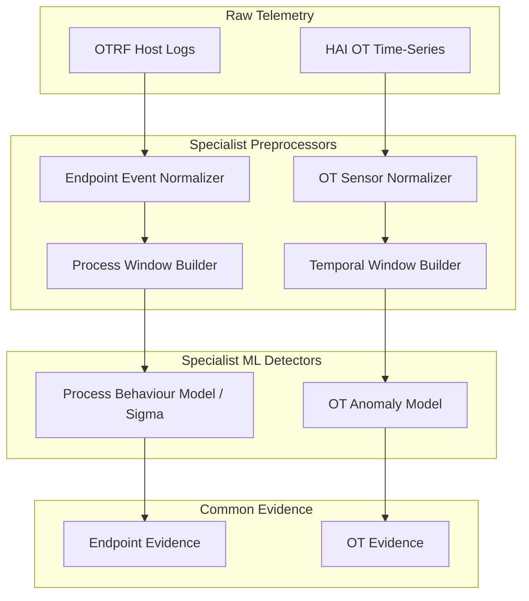

# Endpoint and OT/ICS Dataset Inspection Report

This report documents the dataset inspection, schema discovery, ground truth analysis, and training design recommendations for integrating **Endpoint (OTRF/Mordor)** and **OT/ICS (HAI)** specialists into the `Sentient-Prime` resilience pipeline.

---

# Endpoint / OTRF Inspection

## Dataset Location Strategy
To preserve repository safety and avoid committing massive binary datasets, the OTRF dataset remains **external** to the codebase. It is resolved using the `OTRF_DATASET_PATH` environment variable:
- **Default/Preferred Location**: `C:\Users\Aanoush Surana\OneDrive\Desktop\ET Hackathon\OTRF-Endpoint-Data\datasets\atomic\windows`
- **Fallback Discovery**: Attempts conservative path resolution relative to the repository workspace structure. If not found, a clear `FileNotFoundError` is raised.

## Archive Discovery
- **Total host archives discovered**: 112 ZIP files (only files located in a `host` parent directory are selected to target endpoint events).
- **Extraction strategy**: Archives are processed incrementally, opening one archive at a time and releasing zip resources immediately after parsing to maintain a low RAM footprint.

## Observed Telemetry Providers & Event IDs
The primary telemetry providers and Windows logs observed include:
- `Microsoft-Windows-Sysmon`
- `Microsoft-Windows-Security-Auditing`
- `Microsoft-Windows-PowerShell`
- `PowerShell Operational`
- `WMI Activity`

Among Sysmon logs, the most prominent Event IDs detected are:
- **Event ID 1** (Process Creation)
- **Event ID 3** (Network Connection)
- **Event ID 7** (Image Load)
- **Event ID 10** (Process Access)
- **Event ID 11** (File Create)
- **Event ID 12/13/14** (Registry Actions)

## Observed Schema & Field Aliases
OTRF logs are recorded under heterogeneous event structures. Dynamic alias discovery maps them to canonical schemas:
- **`process_name`**: Mapped from `Image`, `process.executable`, `process.name`.
- **`command_line`**: Mapped from `CommandLine`, `process.command_line`.
- **`process_id`**: Mapped from `ProcessId`, `process.pid`, `ProcessID`.
- **`timestamp`**: Mapped from `UtcTime`, `@timestamp`, `TimeCreated`.

## Process-Tree Feasibility
- **Feasibility Rating**: **LOW** (in raw, un-normalized logs).
- **Reason**: The raw JSON records exhibit fragmented field names depending on the capture agent version. When mapped to canonical fields, the parent-child PID links and computer name attributes have low initial availability in the raw atomic datasets.
- **Remedy**: A robust normalization adapter is required to resolve these aliases into a common schema before constructing process graph trees.

## Ground-Truth Level
- **Classification**: **GROUND_TRUTH_LEVEL_4_SCENARIO**
- **Reasoning**: Raw OTRF event logs do not contain explicit "malicious/benign" flags on individual events. The file name and tactic/technique directory structure (e.g. `credential_access/empire_mimikatz_logonpasswords.zip`) represent the coarse execution context. Treating all events in an attack scenario as malicious is incorrect (as it flags normal background process creation), so ground truth is coarse scenario-level only.

## Recommended Training Unit
- **Recommended Unit**: **HOST_TIME_WINDOW** or **PROCESS_TIME_WINDOW**
- **Reasoning**: Because individual events lack labels and process identity fields are partially available, grouping events within rolling temporal windows per host represents the most stable training unit.

## Candidate Behavioural Features
- **Raw Context**: `timestamp`, `computer_name`, `process_name`, `command_line`.
- **Model Candidates**: `process_depth`, `child_process_count`, `command_length`, `powershell_flag`, `lolbin_flag`, `network_connection_count`.
- **Sigma Feasibility**: Highly feasible. Windows Sysmon fields map 1-to-1 with Sigma rule specifications.

---

# OT / ICS HAI Inspection

## Files Discovered
- **CSV Data Files**: 38 files discovered recursively inside `data/raw/HAI/archive (1).zip`.
- **Train/Test Candidates**:
  - **Train**: `train1.csv` to `train6.csv` (contains normal baseline operations).
  - **Test/Attack**: `test1.csv` to `test4.csv` (contains active attack scenarios).

## Schema and Tag Categories
The telemetry contains 88 columns, including:
- **`timestamp`**: Ordered time-series strings.
- **`Attack`**: Binary attack execution label.
- **Process variables**: classified into:
  - `SENSOR_PROCESS_VALUE` (e.g. `P1_FT01`, continuous float tags).
  - `ACTUATOR_CONTROL_STATE` (e.g. `P1_FCV01D` / `P1_FCV01Z`, control valve positions).
  - `SETPOINT` (e.g. `P1_PP04SP`, reference setpoints).
  - `STATUS_MODE` (e.g. `P2_OnOff`, binary statuses).

## Temporal Structure & Sampling Interval
- **Sampling Interval**: Exactly **1.0 second** (median gap = 1.00s, standard deviation = 0.00s).
- **Regularity**: Fixed interval, sequentially ordered. Highly suitable for time-series rolling models.

## Attack Distribution
In the representative file `hai-22.04/test1.csv`:
- **Normal Rows**: 85,515 (98.98%)
- **Attack Rows**: 885 (1.02%)
- *Imbalance*: Severe class imbalance, characteristic of real-world OT intrusion captures.

## Top 15 Distribution-Shift Process Variables
The following variables show the strongest normalized mean shifts between normal and attack periods:
1. `P1_PCV02D` (Mean Shift: 0.0863 | Normalized Shift: 3.7758)
2. `P1_FCV01D` (Mean Shift: 13.7680 | Normalized Shift: 1.4089)
3. `P1_FCV01Z` (Mean Shift: 13.8339 | Normalized Shift: 1.3973)
4. `P1_FT02` (Mean Shift: 655.9083 | Normalized Shift: 1.3666)
5. `P1_B4005` (Mean Shift: 26.9295 | Normalized Shift: 1.3031)
6. `P1_FT02Z` (Mean Shift: 836.4677 | Normalized Shift: 1.2769)
7. `P1_B400B` (Mean Shift: 835.6904 | Normalized Shift: 1.2759)
8. `P1_PP04` (Mean Shift: 8.8910 | Normalized Shift: 1.1185)
9. `P1_FT01` (Mean Shift: 7.7469 | Normalized Shift: 1.0123)
10. `P1_TIT02` (Mean Shift: 2.8511 | Normalized Shift: 0.8842)
11. `P1_FCV02Z` (Mean Shift: 22.7905 | Normalized Shift: 0.8131)
12. `P1_TIT03` (Mean Shift: 0.4628 | Normalized Shift: 0.7546)
13. `P1_FT01Z` (Mean Shift: 28.9944 | Normalized Shift: 0.7332)
14. `P1_LIT01` (Mean Shift: 22.1453 | Normalized Shift: 0.6979)
15. `P1_PCV02Z` (Mean Shift: 0.1442 | Normalized Shift: 0.6591)

## Multivariate Relationships & Windowing Feasibility
- **Multivariate Feasibility**: Highly feasible. Strong pairwise correlations exist between process tags (e.g. `P1_B400B` and `P1_FT02Z` at `0.9951` correlation), indicating tight control loop constraints.
- **Recommended Window Length**: **60 samples** (1.0 minute duration).
- **Reasoning**: Captures localized process-state transitions without high memory overhead (estimated memory is only ~33.8 KB per window).

## Model Recommendations
- **Primary Low-Compute Model**: Isolation Forest trained on rolling statistical features (rolling mean, rolling std, first difference).
- **Optional Medium-Compute Upgrade**: A small **TCN-Autoencoder** to learn cross-sensor correlation residuals and detect low-and-slow process deviations.

---

# Recommended Sentient-Prime Specialist Architecture

The proposed expansion integrates the Endpoint and OT/ICS detectors alongside the existing Network and Identity pipelines:

