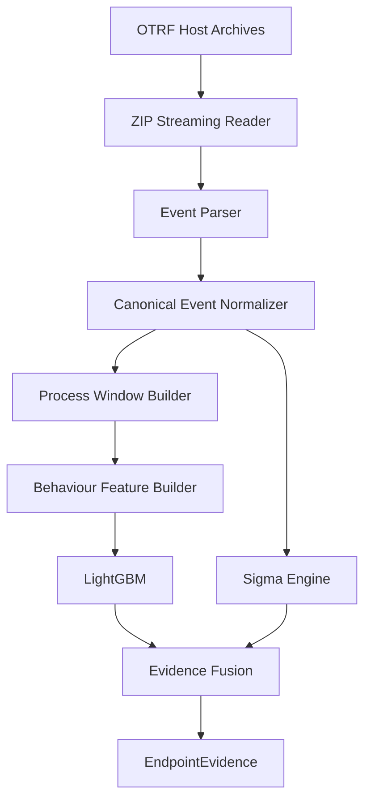

# Endpoint Specialist

The Endpoint Specialist provides host-level detection capability for `Sentient-Prime` by integrating **LightGBM behavioral classification** and **Sigma rule detection** over normalized Windows host events.

## Architecture

The data flow from raw telemetry to final threat evidence is represented below:

## Features and Inputs
- **Inputs**: Recursively crawls OTRF Windows host telemetry ZIP files without permanent extraction. Resolves paths dynamically via the `OTRF_DATASET_PATH` environment variable.
- **Normalization**: Standardizes diverse event log namespaces (e.g. Sysmon, Security Auditing, PowerShell logs) into a canonical `EndpointEvent` schema.
- **Temporal Windows**: Aggregates logs into tumbling 60-second process-centric windows grouped by `(host, process_name, process_id)`.
- **Behavioral Features**: Computes 26 features:
  - Process execution topology (depth, child process counts, spawning frequency).
  - Executable attributes (PowerShell, LOLBins, script interpreter flags).
  - Registry, file, and incoming/outgoing network metrics.
  - Process access details (LSASS access attempts, remote thread injection).

## Machine Learning Model
- **Algorithm**: LightGBM Binary Classifier.
- **Labeling Strategy**: Incorporates a heuristic labeling process mapping known offensive executables and highly suspicious activities (LSASS memory read, encoded commands, remote threads) to target labels, avoiding default noisy scenario labeling.
- **Validation Split**: Splitted chronologically (70% train, 15% val, 15% test) to prevent temporal leakage.

## Sigma Rule Matcher
- **Implementation**: Lightweight, safe Python engine that parses standard YAML Sigma rules without invoking unsafe `eval()` string executors.
- **Fusing Rules and ML**: Neither source dominates. Evidence fusion handles cases ranging from high-precision known tactics (Sigma matching) to raw statistical shifts (LightGBM).

## Artifacts and Outputs
- Model Pickle: `models/endpoint/lightgbm_model.pkl`
- Feature Contract: `models/endpoint/feature_contract.json`
- Performance Report: `data/processed/endpoint/reports/performance_report.md`
- Preprocessing Report: `data/processed/endpoint/metadata/preprocessing_report.md`
- Evaluation Report: `data/processed/endpoint/reports/evaluation_report.md`

## Known Limitations & Roadmap
1. **Benign baseline**: Current atomic test sets have a high concentration of threat activities; roadmap includes injecting benign user baselines.
2. **PID collisions**: Collisions can occur across distinct boots or host names; compound keys are strictly enforced.
