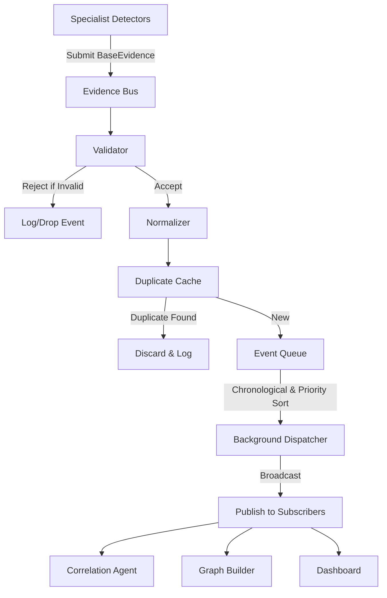

# Evidence Bus and Streaming Framework Documentation

This document describes the streaming architecture, communication protocol, routing, caching, and subscription interfaces of the **Evidence Bus** inside Sentient-Prime.

---

## Processing Flow



---

## Event Priority and Status

Every event gets wrapped as an `EvidenceEvent` containing:
- **`priority`**: Controlled by UEF mapping configurations (`LOW`, `NORMAL`, `HIGH`, `CRITICAL`).
- **`status`**: Transitions automatically through state lifecycle:
  `CREATED` → `VALIDATED` → `QUEUED` → `PROCESSING` → `PROCESSED` (or `FAILED`).

---

## Duplicate Cache (Deduplication)

To prevent processing redundant alerts, the bus computes a SHA-256 hash of the evidence's core attributes. If identical evidence arrives within the configured TTL (default 10 minutes), the bus discards the record automatically.

---

## Configuration

Configuration values are stored in `config/evidence_bus.yaml`. The core properties are:

```yaml
queue_size: 10000        # Max buffer size
cache_size: 10000        # Max cache size for duplicate tracking
cache_ttl: 600           # TTL in seconds (10 minutes)
max_batch: 100           # Batch sizes
priority_mapping:        # Severity to priority translation
  CRITICAL: "CRITICAL"
  HIGH: "HIGH"
  MEDIUM: "NORMAL"
  LOW: "LOW"
```

---

## API Reference

### Accessing the Bus (Singleton pattern)

```python
from core.evidence import EvidenceBus

# Retrieve the running bus singleton
bus = EvidenceBus.get_instance()
```

### Pushing Evidence (Detectors)

```python
# Push evidence synchronously
success = bus.push(my_evidence)
```

### Registering Subscribers

```python
from core.evidence import Subscriber, EvidenceEvent, SubscriberFilter

class CustomSubscriber(Subscriber):
    def receive(self, event: EvidenceEvent) -> None:
        print(f"Received event: {event.event_id} from {event.detector}")

    def health(self) -> str:
        return "Healthy"

# Define filters
filters = SubscriberFilter(
    detectors=["NETWORK", "ENDPOINT"],
    severities=["HIGH", "CRITICAL"]
)

sub = CustomSubscriber("MyCustomConsumer", filter_criteria=filters)
bus.register(sub)
```

### Health Diagnostics and Telemetry

```python
# Check health
health_data = bus.health()
print(health_data["status"])

# Fetch metrics
metrics_data = bus.metrics()
print(metrics_data["events_received"])
```
