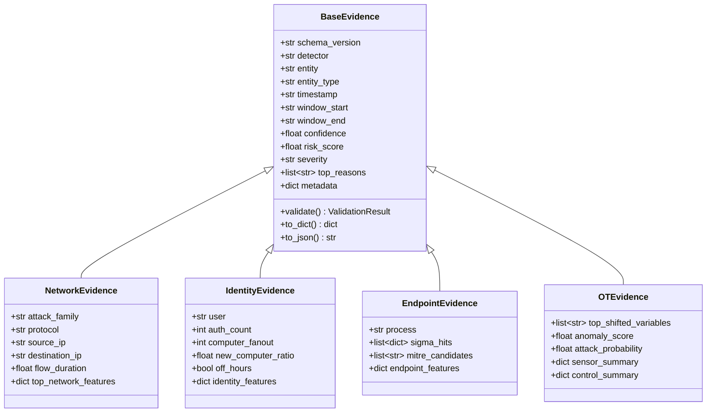

# Unified Evidence Framework (UEF) Documentation

This document describes the design, schema, and usage of the **Unified Evidence Framework (UEF)** in Sentient-Prime. UEF establishes a standardized language for specialist detectors to publish alerts, indicators, and telemetry features to future correlation and AI layers.

---

## Architecture Overview



---

## Core Evidence Schema

Every evidence object inherits from `BaseEvidence`. The mandatory fields are:

| Field Name | Type | Description |
| :--- | :--- | :--- |
| `schema_version` | `str` | Schema version (currently `"v1"`). |
| `detector` | `DetectorType` (Enum/str) | Source detector (`NETWORK`, `IDENTITY`, `ENDPOINT`, `OT`). |
| `entity` | `str` | The unique identifier of the target entity (e.g. host IP, user name). |
| `entity_type` | `EntityType` (Enum/str) | Entity classification (`HOST`, `USER`, `PROCESS`, `DEVICE`, etc.). |
| `timestamp` | `str` | ISO 8601 string of when the evidence was detected. |
| `window_start` | `str` | Temporal window start time. |
| `window_end` | `str` | Temporal window end time. |
| `confidence` | `float` | Detection confidence from `0.0` (none) to `1.0` (absolute). |
| `risk_score` | `float` | Cyber threat risk score from `0.0` (benign) to `1.0` (critical). |
| `severity` | `SeverityLevel` (Enum/str) | Severity tier (`INFO`, `LOW`, `MEDIUM`, `HIGH`, `CRITICAL`). |
| `top_reasons` | `List[str]` | Human-readable explanation reasons (no feature coefficients). |
| `metadata` | `Dict[str, Any]` | Detector-specific features/context dict. |

---

## Usage Examples

### Instantiating Specialized Evidence

```python
from core.evidence import NetworkEvidence, SeverityLevel, DetectorType, EntityType

evidence = NetworkEvidence(
    detector="NETWORK",
    entity="192.168.1.100",
    entity_type="HOST",
    timestamp="2026-07-13T19:08:00+00:00",
    window_start="2026-07-13T19:00:00+00:00",
    window_end="2026-07-13T19:10:00+00:00",
    confidence=0.95,
    risk_score=0.88,
    severity="HIGH",
    top_reasons=["High DNS beacon frequency to known malicious domain"],
    metadata={"destination_port": 53},
    attack_family="DNS-Beaconing",
    protocol="UDP",
    source_ip="192.168.1.100",
    destination_ip="8.8.8.8",
    flow_duration=120.5
)
```

### Validating and Serializing

```python
# Validation
result = evidence.validate()
if result.valid:
    print("Evidence is valid!")
else:
    print(f"Errors found: {result.errors}")

# Serialization to dict/JSON
json_str = evidence.to_json(indent=2)
print(json_str)
```
