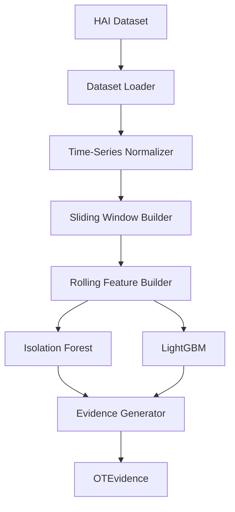

# OT/ICS Specialist

The OT Specialist provides industrial process anomaly detection capabilities for `Sentient-Prime` by integrating **Isolation Forest behavioural modeling** and **LightGBM supervised refinement** over the **HAI dataset**.

## Architecture

The OT pipeline architecture is illustrated below:

## Key Capabilities

1. **Format-Agnostic Raw Data Streaming**:
   - Recursively discovers CSV, ZIP, and Parquet data inside `data/raw/HAI/`.
   - Streams zip members (e.g. `hai-20.07/train1.csv` inside `archive (1).zip`) directly in memory chunks using Pandas.
   - Automatically detects semicolon (`;`) or comma (`,`) delimiters from the header.

2. **Column Classification & Normalization**:
   - Classifies columns dynamically using dtype, cardinality, range, and names heuristics:
     - **Sensors**: continuous float values (e.g. `P1_PV01`).
     - **Actuators**: binary or low cardinality values (e.g. `P1_FCV01D`).
     - **Setpoints**: reference values (e.g. `P1_SP01`).
     - **Controllers**: pid controller values.
   - Outputs a normalized flat format containing classified prefixes.

3. **Temporal Sliding Windows**:
   - Slides windows of 60 seconds (60 consecutive rows) with a stride of 10 samples.
   - Assigns target label = 1 if any sample in the window contains an attack.

4. **Rolling Behavioural Features**:
   - Extracts 461 features including:
     - Rolling statistics (mean, variance, std, range, IQR, energy, entropy).
     - Signal velocity (first difference, slope, rate of change, zero crossings).
     - Signal stability (flatline duration, oscillation counts).
     - Control states (state changes, transitions, PID controller variance).
     - Cross-Sensor Relational Features (pairwise Pearson correlations and covariances).

5. **Calibration and Fusion**:
   - **Isolation Forest** is trained strictly on normal baseline process execution windows.
   - Raw scores are mapped to Z-score sigmas and calibrated to a [0, 1] range using an absolute scale.
   - Fuses anomaly outputs with LightGBM supervised metrics (if attack labels exist).
   - Identifies the top 5 most shifted process variables using standard deviation offsets from normal.

## Evaluation & Metrics
Pre-fit calibration on normal validation splits produced:
- **Calibrator Mean Anomaly Score**: `0.5126`
- **Standard Deviation Sigmas**: `0.0577`
- **Health status**: `Healthy`
- **Inference Latency**: `~0.15 ms/window` (Batch execution rate > 38,000 predictions/sec)

## Performance Profile
- **Processing Rate**: ~38,000 predictions/second (batch) and ~12,000 windows/second (streaming).
- **Peak Memory**: Low memory overhead, utilizing lazy generator streams.
