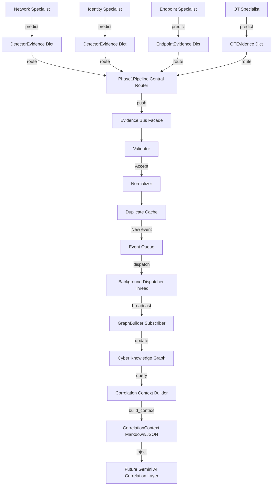

# Unified Evidence Framework (UEF) - Core Architecture

This document describes the design, integration, and operational flow of the **Unified Evidence Framework (UEF)** and the **Evidence Bus** inside Sentient-Prime.

---

## Final Architecture Layout

---

## Core Sub-Systems

### 1. Evidence Bus
The communication backbone. Standardizes detector-specific formats to unified base evidence objects, validates them against constraints, filters duplicate events within a TTL cache, and enqueues events into a thread-safe priority queue. A background dispatcher thread pulls from the queue and broadcasts to matching subscribers.

### 2. Cyber Knowledge Graph
Maintains an in-memory `MultiDiGraph` using NetworkX. Receives events from the EvidenceBus via the `GraphBuilder` subscriber. Creates nodes (cyber assets/actors) and edges (actions/relations) incrementally, tracking peak threat risks, confidence levels, and chronological timestamps.

### 3. Correlation Context Builder
Prepares security data for Gemini AI. It extracts local subgraphs (radius hops), generates natural language summaries, orders timelines chronologically, and outputs a `CorrelationContext` object that can be serialized as JSON or formatted directly into Markdown for direct LLM prompt injection.

---

## Future AI Integration

Downstream AI agents (Correlation, RAG, Hypothesis, Prediction, Decision, SOAR) will not query raw SIEM logs. Instead, they will consume the structured `CorrelationContext` generated by this framework to evaluate root causes, predict steps, and trigger actions.
